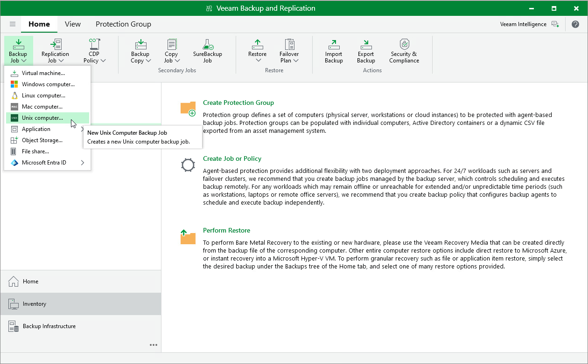

# Step 1. Launch New Agent Backup Job Wizard

You can create a Veeam Agent backup policy for protected machines that run a Unix OS in one of the following ways:

* [Create a new backup policy](#simple) — in this case, Veeam Backup & Replication launches the New Agent Backup Job wizard. You can specify protection groups, individual Active Directory objects and Veeam Agent computers to which the backup policy settings must apply at the [Computers](agent_job_comp_linux.md) step of the wizard.
* [Add a protection group to a new backup policy](#group) — in this case, Veeam Backup & Replication launches the New Agent Backup Job wizard and adds the selected protection group to the backup policy. You can edit the list of the Veeam Agent machines to which the backup policy settings must apply at the [Computers](agent_job_comp_linux.md) step of the wizard.
* [Add individual machines to a new backup policy](#computers) — in this case, Veeam Backup & Replication launches the New Agent Backup Job wizard and adds the selected machines to the backup policy. You can edit the list of Veeam Agent machines to which the backup policy settings must apply at the [Computers](agent_job_comp_linux.md) step of the wizard.

Launching Backup Job Wizard

To launch the New Agent Backup Job wizard, do one of the following:

* On the Home tab, click Backup Job > Unix computer.
* Open the Home view. Select the Jobs node and click Backup Job > Unix computer on the ribbon.
* Open the Home view. Right-click the Jobs node and select Backup > Unix computer.

Adding Protection Group to New Backup Policy

To add a protection group to a new Veeam Agent backup policy, do one of the following:

* Open the Inventory view. Then, in the Physical and Cloud Infrastructure node, right-click the protection group that you want to add to the backup policy and select Add to backup job > Unix > New job.
* Open the Inventory view. Then, in the Physical and Cloud Infrastructure node, select the protection group that you want to add to the backup policy and click Add to Backup > Unix > New job on the ribbon.

Veeam Backup & Replication will start the New Agent Backup Job wizard and add the protection group to the policy. You can add other protection groups and individual machines to the policy later on when you pass through the wizard steps.

Adding Machines to New Backup Policy

To add specific machines to a new Veeam Agent backup policy, do either of the following:

* Open the Inventory view. Then, in the Physical and Cloud Infrastructure node, click the protection group whose machines you want to add to the backup policy. In the working area, select one or more machines that you want to add to the policy, right-click the selected computer and select Add to backup job > New job.
* Open the Inventory view. Then, in the Physical and Cloud Infrastructure node, click the protection group whose machines you want to add to the backup policy. In the working area, select one or more machines that you want to add to the policy and click Add to Backup > New job on the ribbon.

Veeam Backup & Replication will start the New Agent Backup Job wizard and add the selected machines to the policy. You can add other machines and protection groups to the policy later on when you pass through the wizard steps.

|  |
| --- |
| TIP |
| Consider the following:   * To select multiple machines at once, press and hold the [Ctrl] key. * You can add an individual machine or protection group to a Veeam Agent backup policy that is already configured in Veeam Backup & Replication. To learn more, see [Adding Computers to Backup Job](agents_protected_computers_add.md) and [Adding Protection Group to Backup Job](agents_protection_group_job.md). |

Page updated 2026-06-24

