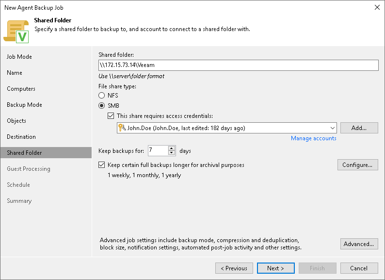

# Shared Folder Settings

At the Shared Folder step of the wizard, specify shared folder settings:

1. In the File share type section, select the type of a network shared folder:

* NFS — to connect to a network shared folder using the NFS protocol.
* SMB — to connect to a network shared folder using the SMB (CIFS) protocol.

1. In the Shared folder field, type a name of the network shared folder in which you want to store backup files.

* [For an NFS shared folder] Specify a name of the network shared folder in the SERVER:/DIRECTORY format.
* [For an SMB shared folder] Specify a UNC name of the network shared folder. Keep in mind that the UNC name always starts with two back slashes (\\).

1. [For an SMB shared folder] If the network shared folder requires authentication, select the This share requires access credentials check box and select from the list a user account that has access permissions on this shared folder. If you have not set up credentials beforehand, click the Manage accounts link or click Add on the right to add credentials.

The user name can be specified in the following formats:

* DNS.DOMAIN.NAME\USERNAME
* USERNAME@DNS.DOMAIN.NAME

1. In the Keep backups for field, specify the number of days for which you want to store backup files in the target location. After this period is over, Veeam Agent will remove from the backup chain any restore points that are older than the specified retention period. By default, Veeam Agent keeps backup files for 7 days. To learn more, see [Short-Term Retention Policy](agents_retention.md).
2. To use the GFS (Grandfather-Father-Son) retention scheme, select the Keep certain full backups longer for archival purposes check box and click Configure. In the Configure GFS window, specify how weekly, monthly and yearly full backups must be retained. To learn more, see [Long-Term Retention Policy (GFS)](gfs_retention_policy.md).

Keep in mind that to use the GFS retention policy, you must set Veeam Agent to create full backups. To learn more, see [Backup Settings](agent_policy_advanced_backup_linux.md).

1. Click Advanced to specify advanced settings for the backup policy. To learn more, see [Specify Advanced Backup Settings](agent_policy_advanced_linux.md).

