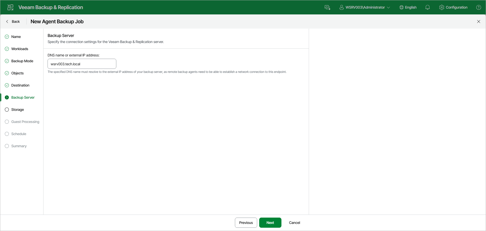
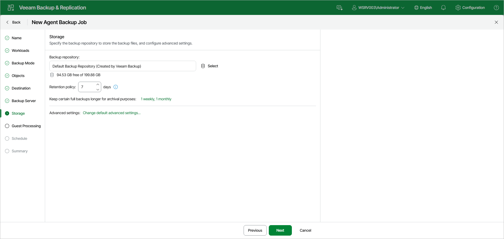

# Veeam Backup Repository Settings

If you have selected the Veeam backup repository option at the [Destination](agent_policy_target_linux_web.md) step of the wizard, specify settings to connect to the backup repository:

1. [At the Backup Server step of the wizard, specify backup server settings](#vbr).
2. [At the Storage step of the wizard, select the Veeam backup repository and configure retention](#repo).

Specifying Backup Server Settings

At the Backup Server step of the wizard, specify the connection settings for the Veeam Backup & Replication server that will manage backups created by Veeam Agents on protected computers.

In the DNS name or external IP address field, make sure that the name or IP address of the Veeam Backup & Replication server, on which you configure the Veeam Agent backup policy, is displayed. Do not specify the name or IP address of another backup server. The specified DNS name must resolve to the external IP address of the backup server, as remote Veeam Agents need to be able to establish a network connection to this endpoint.

|  |
| --- |
| IMPORTANT |
| Consider the following:   * Veeam Backup & Replication does not automatically update information about the backup server in the backup policy settings after migration of the configuration database. After you migrate configuration data to a new location, you must specify the name or IP address of the new backup server in the properties of all backup policies configured in Veeam Backup & Replication. * If you enable the High Availability (HA) cluster in your backup infrastructure, you cannot modify the displayed DNS name or external IP address. The backup server information is automatically populated with the HA cluster details. Any existing policies created before enabling HA will automatically have this setting updated.   To learn more, see [High Availability (HA) Cluster](high_availability_cluster.md). |

Selecting Backup Repository

At the Storage step of the wizard, specify the backup repository to store the backup files, and configure advanced settings:

1. In the Backup repository field, click Select and choose a backup repository where you want to store created backups. When you select a backup repository, Veeam Backup & Replication automatically checks and displays the amount of free space available on the backup repository.
2. In the Retention policy field, specify the number of days for which you want to store backup files in the target location. After this period is over, Veeam Agent will remove from the backup chain any restore points that are older than the specified retention period. By default, Veeam Agent keeps backup files for 7 days. To learn more, see [Short-Term Retention Policy](agents_retention.md).
3. To use the GFS (Grandfather-Father-Son) retention scheme, next to Keep certain full backups longer for archival purposes, click the current setting summary. In the Configure GFS window, specify how weekly, monthly and yearly full backups must be retained. To learn more, see [Long-Term Retention Policy (GFS)](gfs_retention_policy.md).

Keep in mind that to use the GFS retention policy, you must set Veeam Agent to create full backups. To learn more, see [Backup Settings](agent_policy_advanced_backup_linux_web.md).

1. Click Change default advanced settings to specify advanced settings for the backup policy. To learn more, see [Specify Advanced Backup Settings](agent_policy_advanced_linux_web.md).

|  |
| --- |
| NOTE |
| You must enable backup file encryption in the [backup policy storage settings](agent_policy_advanced_storage_linux_web.md) if you back up data to the Veeam Data Cloud Vault storage added as a Veeam backup repository. |

Page updated 2026-07-17

