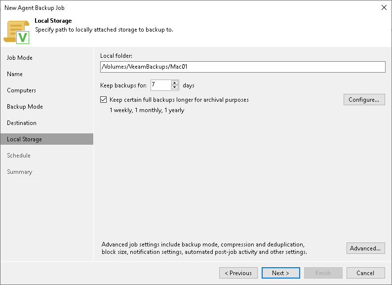

# Local Storage Settings

The Local Storage step of the wizard is available if you have chosen to save the backup on a local drive of your computer.

Specify local storage settings:

1. In the Local folder field, type a path to a folder on a protected computer where backup files must be saved. If the specified folder does not exist in the file system of a protected computer, Veeam Agent will create this folder and save the resulting backup file to this folder. If the volume on which the specified folder must reside does not exist on a protected computer, Veeam Backup & Replication will not apply the backup policy settings to this computer.

|  |
| --- |
| IMPORTANT |
| USB storage devices formatted as FAT32 do not allow storing files larger than 4 GB in size. For this reason, it is recommended that you do not use such USB storage devices as a backup target. |

1. In the Keep backups for field, specify the number of days for which you want to store backup files in the target location. After this period is over, Veeam Agent will remove from the backup chain any restore points that are older than the specified retention period. By default, Veeam Agent keeps backup files for 7 days. To learn more, see [Short-Term Retention Policy](agents_retention.md).
2. You can apply GFS (Grandfather-Father-Son) retention scheme to the backup policy. To specify GFS retention, select the Keep certain full backups longer for archival purposes check box and click Configure. In the Configure GFS window, specify how weekly, monthly and yearly full backups must be retained. To learn more, see [Long-Term Retention Policy (GFS)](gfs_retention_policy.md).

Keep in mind that to use the GFS retention policy, you must set Veeam Agent to create full backups. To learn more, see [Backup Settings](agent_policy_advanced_backup_mac.md).

1. Click Advanced to specify advanced settings for the backup policy. To learn more, see [Specify Advanced Backup Settings](agent_policy_advanced_mac.md).

