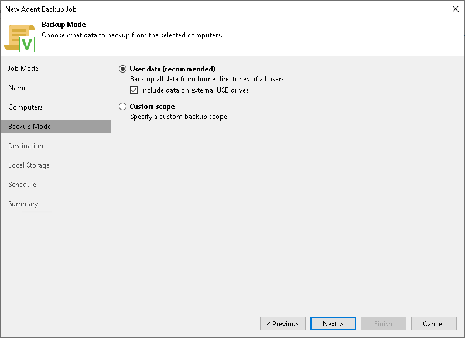

# Step 5. Select Backup Mode

At the Backup Mode step of the wizard, select the mode in which you want to create a backup. You can select one of the following options:

* User data — select this option if you want to create a backup of the Users folder that contains the Home folders of all users. With this option selected, you will pass to the [Destination](agent_policy_target_mac.md) step of the wizard.

To include user data residing on an external USB drive, select the Include external USB drives check box. The USB drive must be mounted to a location within the Users folder. You can include user data from one or more USB drives connected to the Veeam Agent computer at the time when the backup job starts on the protected computer.

|  |
| --- |
| NOTE |
| When you select User data mode, Veeam Agent excludes network shared folders from the backup scope. To back up a network shared folder, you must select the Custom scope option and add this network shared folder as an individual object to the backup scope at the Objects step of the wizard. |

* Custom scope — select this option if you want to create a backup of individual folders on your computer. With this option selected, you will pass to the [Objects](agent_policy_scope_mac.md) step of the wizard.At the Backup Mode step of the wizard, select the mode in which you want to create a backup.

