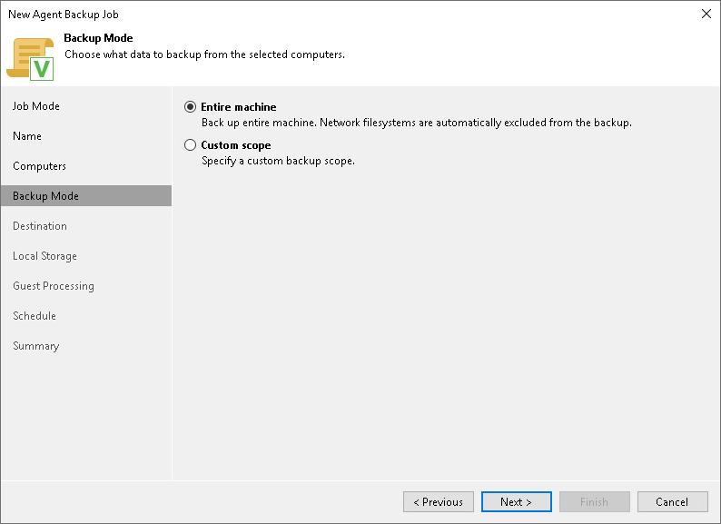

# Step 5. Select Backup Mode

At the Backup Mode step of the wizard, select the mode in which you want to create a backup. You can select one of the following options:

* Entire machine — select this option if you want to create a backup of all files and directories available on the protected Unix computer.

Consider that in the Entire machine mode, Veeam Agent excludes network shared folders from the backup scope. To back up network shared folders, use the Custom scope mode.

* Custom scope — select this option if you want to create a backup of individual directories on your computer. With this option selected, you will pass to the [Objects](agent_policy_scope_unix.md) step of the wizard.

|  |
| --- |
| TIP |
| If you plan to back up a network shared folder, you must select the Custom scope option and add this network shared folder as an individual object to the backup scope at the Objects step of the wizard. |

