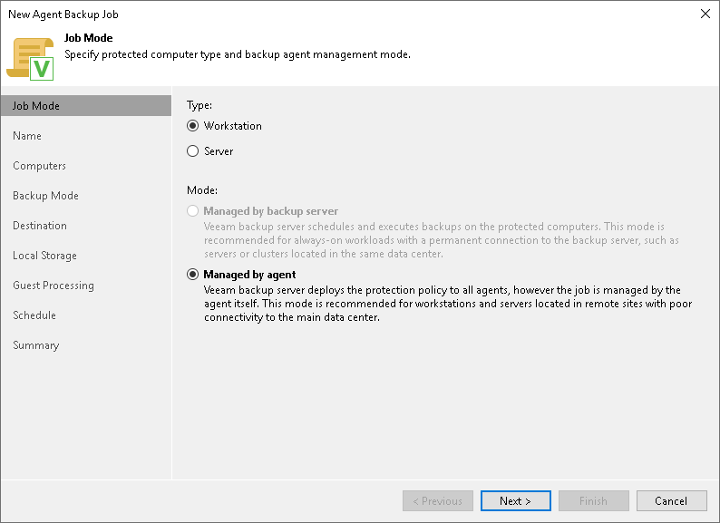

# Step 2. Select Job Mode

At the Job Mode step of the wizard, specify protection settings for the Veeam Agent backup policy:

1. [Select the type of protected computers whose data you want to back up with Veeam Agents](#type).
2. [If you choose to back up data on servers, select the job mode](#mode).

Selecting Protected Computer Type

At the Job Mode step of the wizard, in the Type field, select the type of protected computers whose data you want to back up with Veeam Agents. The selected type defines what settings will be available for the configured backup policy. You can select one of the following computer types:

* Workstation — select this option if you want to back up data on Linux-based workstations or laptops. This option is suitable for computers that reside in a remote location and may have limited connection to the backup server.

For backup policies that process workstations, Veeam Backup & Replication offers settings similar to the job settings available in Veeam Agent for Linux operating in the Workstation mode. To learn more, see the [Product Editions](https://helpcenter.veeam.com/docs/agentforlinux/userguide/license_modes.html?ver=13) section in the Veeam Agent for Linux User Guide.

With this option selected, the backup policy will be managed by Veeam Agent installed on the protected computer — you do not need to select the job mode.

* Server — select this option if you want to back up data on Linux-based servers. This option is suitable for computers that have permanent connection to the backup server.

For backup policies that process servers, Veeam Backup & Replication offers settings similar to the job settings available in Veeam Agent for Linux operating in the Server mode. To learn more, see the [Veeam Agent for Linux User Guide](https://helpcenter.veeam.com/docs/agentforlinux/userguide/overview.html?ver=13).

With this option selected, you can select the job mode. To learn more, see [Selecting Job Mode](#mode).

Selecting Job Mode

If you selected the Workstation computer type in the Type field, you do not need to select the job mode in the Mode field, the Managed by agent job mode will be selected automatically.

If you selected the Server option in the [Type](#type) field, in the Mode field, select the Managed by agent job mode to create a Veeam Agent backup policy. If you select the Managed by backup server job mode, you will create a [Veeam Agent backup job managed by the backup server](agent_job_create_linux.md).

