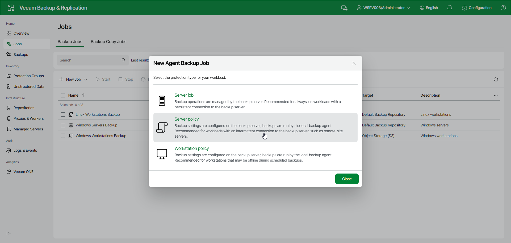

# Step 2. Select Job Mode

In the New Agent Backup Job window, select the protection type for your workload. For a Veeam Agent backup policy, select one of the following options:

* Server policy — select this option to back up data on Linux-based servers. This option is recommended for computers with an intermittent connection to the backup server, such as remote-site servers.

For backup policies that process servers, Veeam Backup & Replication offers settings similar to the job settings available in Veeam Agent for Linux operating in the Server mode. To learn more, see the [Veeam Agent for Linux User Guide](https://helpcenter.veeam.com/docs/agentforlinux/userguide/overview.html?ver=13).

* Workstation policy — select this option to back up data on Linux-based workstations or laptops. This option is recommended for computers that may be offline during scheduled backups.

For backup policies that process workstations, Veeam Backup & Replication offers settings similar to the job settings available in Veeam Agent for Linux operating in the Workstation mode. To learn more, see the [Product Editions](https://helpcenter.veeam.com/docs/agentforlinux/userguide/license_modes.html?ver=13) section in the Veeam Agent for Linux User Guide.

If you want to create a Veeam Agent backup job managed by the backup server, select the Server job option. To learn more, see [Creating Job for Linux Computers Using Web UI](agent_job_create_linux_web.md).

Page updated 2026-07-16

