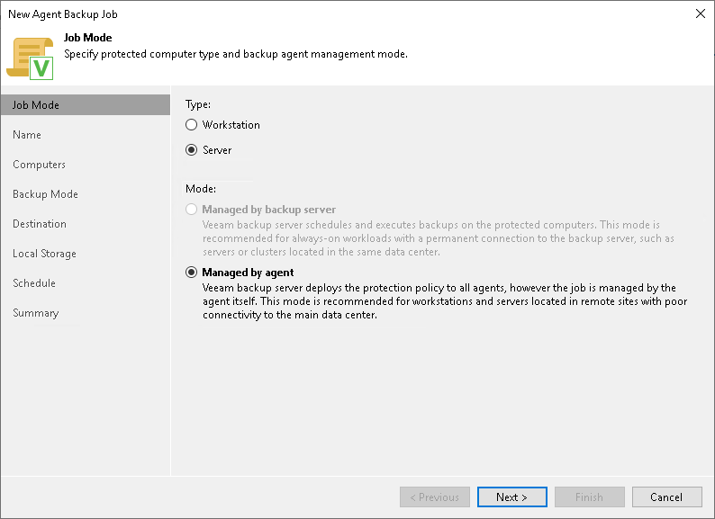

# Step 2. Select Job Mode

At the Job Mode step of the wizard, in the Type field, select the type of protected computers whose data you want to back up with Veeam Agents.

The selected type defines what settings will be available for the configured backup policy. You can select one of the following computer types:

* Workstation — select this option if you want to back up data on macOS workstations or laptops. This option is suitable for computers that reside in a remote location and may have limited connection to the backup server.

For backup jobs that process workstations, Veeam Backup & Replication offers settings similar to the job settings available in Veeam Agent operating in the Workstation mode. To learn more, see the [Product Editions](https://helpcenter.veeam.com/docs/agentformac/userguide/license_modes.html?ver=13) section in the Veeam Agent for Mac User Guide.

* Server — select this option if you want to back up data on macOS servers. This option is suitable for computers that have permanent connection to the backup server.

For backup jobs that process servers, Veeam Backup & Replication offers settings similar to the job settings available in Veeam Agent operating in the Server mode. To learn more, see the [Product Editions](https://helpcenter.veeam.com/docs/agentformac/userguide/license_modes.html?ver=13) section in the Veeam Agent for Mac User Guide.

You do not need to select the job mode. Mac computers can be added only to Veeam Agent backup jobs managed by Veeam Agent.

