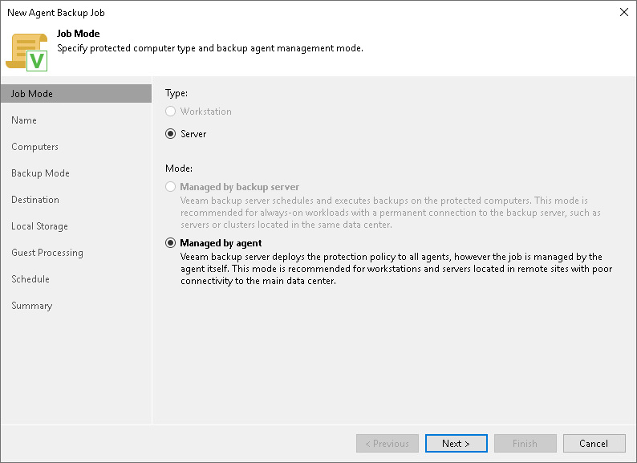

# Step 2. Select Job Mode

In this article

At the Job Mode step of the wizard, click Next.

You do not need to select the job type and mode. Unix computers can be added only as servers and only to Veeam Agent backup jobs managed by Veeam Agent.

Page updated 7/29/2025

Page content applies to build 13.0.1.1071
