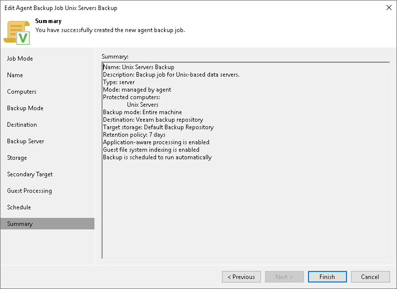

# Step 13. Review Backup Job Settings

At the Summary step of the wizard, complete the Veeam Agent backup policy configuration process.

1. Review settings of the configured backup policy.
2. Click Finish to close the wizard.

Keep in mind that Veeam Backup & Replication does not apply backup policy to Unix computers immediately. Veeam Agents installed on Unix computers connect to Veeam Backup & Replication every 6 hours and get updated backup policy settings. If you targeted a backup policy at the Veeam backup server and scheduled it earlier than the next connection to Veeam Backup & Replication, this backup policy will get updated backup policy settings at the next backup policy session start.

If you want to apply backup policy immediately, you must synchronize Veeam Agent with Veeam Backup & Replication from the Veeam Agent computer side manually. To learn more, see [Configuration](deploy_agent_unix.md#configure).

