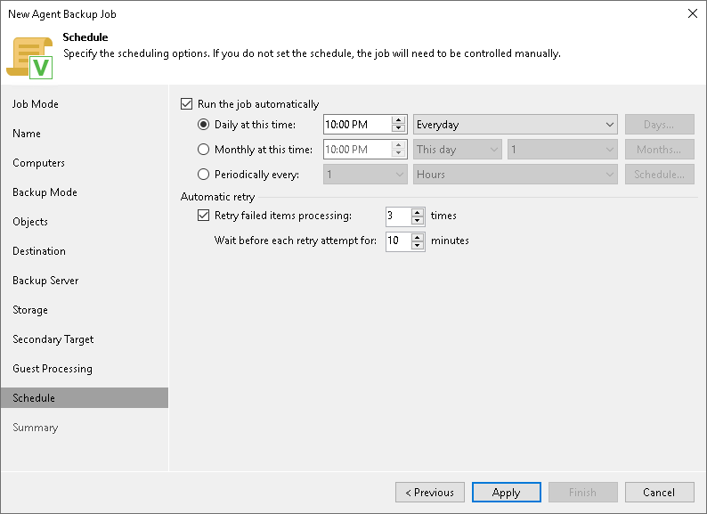

# Step 12. Specify Backup Schedule

In this article

At the Schedule step of the wizard, specify the schedule according to which you want to perform backup.

To specify the Veeam Agent backup policy schedule:

|  |
| --- |
| NOTE |
| The backup job on each Veeam Agent computer runs according to the local time of the computer. |

1. Select the Run the job automatically check box. If this check box is not selected, you will have to start the backup policy manually to create backup.

|  |
| --- |
| NOTE |
| Depending on the type of protected computer you selected at the [Job Mode](agent_job_protection_linux.md) step of the wizard, Veeam Backup & Replication provides the following scheduling options for the backup job:   * [For Workstation] You can set the backup job to run automatically on specific days of the week or daily. * [For Server] You can configure daily, monthly and periodic schedules for the backup job. |

1. Define scheduling settings for the policy:

* To run the policy at specific time daily, on defined week days or with specific periodicity, select Daily at this time. Use the fields on the right to configure the necessary schedule.
* To run the policy once a month on specific days, select Monthly at this time. Use the fields on the right to configure the necessary schedule.
* To run the policy repeatedly throughout a day with a specific time interval, select Periodically every. In the field on the right, select the necessary time unit: Hours or Minutes.
* To run the policy continuously, select the Periodically every option and choose Continuously from the list on the right. A new backup policy session will start as soon as the previous backup policy session finishes.

1. In the Automatic retry section, define whether Veeam Agent for Linux must attempt to run the backup policy again if the policy fails for some reason. Enter the number of attempts to run the policy and define time intervals between them. If you select continuous backup, Veeam Agent for Linux will retry the policy for the defined number of times without any time intervals between the policy runs.

|  |
| --- |
| NOTE |
| After you click Apply at the Schedule step of the wizard, Veeam Backup & Replication will immediately apply the backup policy to protected computers. |

Page updated 11/13/2025

Page content applies to build 13.0.1.1071
