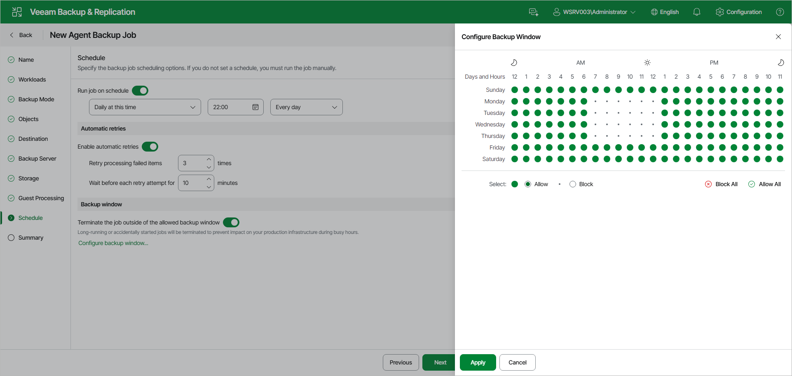

# Step 11. Specify Backup Schedule

At the Schedule step of the wizard, specify the backup job scheduling options. If you do not set a schedule, you must run the job manually.

To specify the Veeam Agent backup policy schedule:

1. Turn on the Run job on schedule toggle. If the toggle is off, you will have to start the backup policy manually to create backup.
2. Define scheduling settings for the policy:

|  |
| --- |
| NOTE |
| The backup policy on each Veeam Agent computer runs according to the local time of the computer. |

|  |
| --- |
| NOTE |
| Depending on the type of protected computer you selected at the [Job Mode](agent_policy_protection_linux_web.md) step of the wizard, Veeam Backup & Replication provides the following scheduling options for the backup policy:   * [For Workstation] You can set the backup policy to run automatically on specific days of the week or daily. * [For Server] You can configure daily, monthly and periodic schedules for the backup policy. |

* To run the policy at a specific time daily, on defined week days or with specific periodicity, select Daily at this time from the drop-down list. Use the fields on the right to configure the necessary schedule.
* To run the policy once a month on specific days, select Monthly at this time. Use the fields on the right to configure the necessary schedule.
* To run the policy repeatedly throughout a day with a specific time interval, select Periodically every. In the field on the right, select the necessary time unit: Hours or Minutes.
* To run the policy continuously, select the Periodically every option and choose Continuously from the list on the right. A new backup policy session will start as soon as the previous backup policy session finishes.

1. In the Automatic retries section, turn on the Enable automatic retries toggle if you want Veeam Agent for Linux to attempt to run the backup policy again if the policy fails for some reason. In the Retry processing failed items field, specify the number of attempts to run the policy. In the Wait before each retry attempt for field, specify the time interval between attempts in minutes. If you select continuous backup, Veeam Agent for Linux retries the policy for the defined number of times without any time intervals between the policy runs.

1. In the Backup window section, define the time interval within which the backup policy is allowed to run. The backup window prevents the policy from overlapping with production hours and ensures that the policy does not impact performance of your server. To set up a backup window for the policy:

1. Turn on the Terminate the job outside of the allowed backup window toggle and click Configure backup window.
2. In the Configure Backup Window window, use the time table to define the allowed and blocked hours for the backup policy:

* The green area indicates the allowed backup window — the hours when the backup policy is allowed to run.
* The white area indicates the blocked window — the hours when the backup policy is not allowed to run. If the Terminate the job outside of the allowed backup window toggle is on, a policy that is still running when the blocked window starts is automatically terminated.
* To change the state of individual cells, next to Select, select Allow or Block, and then click or drag over the cells in the time table. To apply the same state to all cells, click Allow All or Block All.

If the policy exceeds the allowed window, it will be automatically terminated. In this case, data transport and backup chain transformation processes are stopped.

|  |
| --- |
| NOTE |
| After you click Apply at the Schedule step of the wizard, Veeam Backup & Replication will immediately apply the backup policy to protected computers. |

Page updated 2026-07-29

