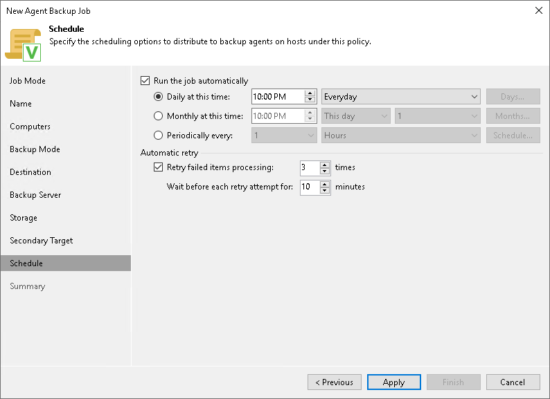

# Scheduling Settings for Servers

In this article

At the Schedule step of the wizard, specify the schedule according to which you want to perform backup.

To specify the job schedule:

|  |
| --- |
| NOTE |
| The backup job on each Veeam Agent computer runs according to the local time of the computer. |

1. Select the Run the job automatically check box. If this check box is not selected, you will have to start the backup job manually to create backup.
2. Define scheduling settings for the job:

* To run the job at specific time daily, on defined week days or with specific periodicity, select Daily at this time. Use the fields on the right to configure the necessary schedule.
* To run the job once a month on specific days, select Monthly at this time. Use the fields on the right to configure the necessary schedule.
* To run the job repeatedly throughout a day with a specific time interval, select Periodically every. In the field on the right, select the necessary time unit: Hours or Minutes.

* To run the policy continuously, select the Periodically every option and choose Continuously from the list on the right. A new backup policy session will start as soon as the previous backup policy session finishes.

1. In the Automatic retry section, define whether Veeam Agent must attempt to run the backup job again if the job fails for some reason. Enter the number of attempts to run the job and define time intervals between them. If you select continuous backup, Veeam Agent for Mac will retry the job for the defined number of times without any time intervals between the job runs.

Page updated 11/13/2025

Page content applies to build 13.0.1.1071
