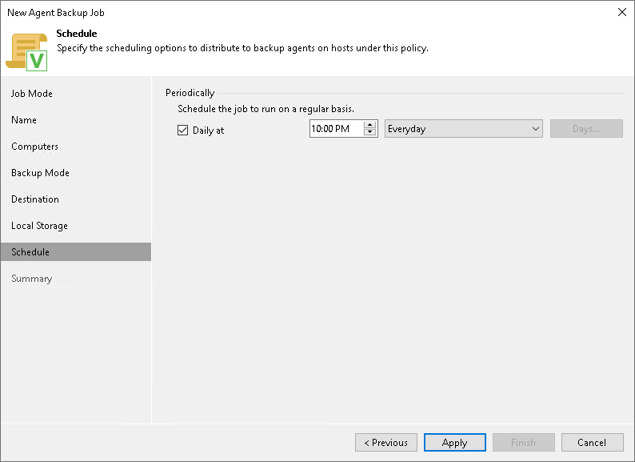

# Scheduling Settings for Workstations

In this article

At the Schedule step of the wizard, specify the schedule according to which you want to perform backup.

To specify the backup job schedule:

|  |
| --- |
| NOTE |
| The backup job on each Veeam Agent computer runs according to the local time of the computer. |

1. Select the Daily at check box and use the fields on the right to specify time and days when the backup job must start:

* Everyday — select this option to start the job at specific time daily.
* On weekdays — select this option to start the job at specific time on weekdays.
* On these days — select this option to start the job at specific time on selected days.

Page updated 11/13/2025

Page content applies to build 13.0.1.1071
