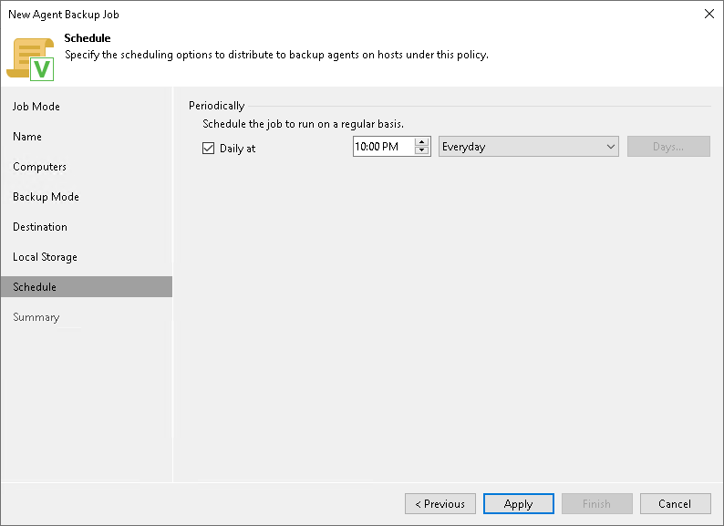

# Scheduling Settings for Workstations

At the Schedule step of the wizard, specify the schedule according to which you want to perform backup.

|  |
| --- |
| NOTE |
| The backup job on each Veeam Agent computer runs according to the local time of the computer. |

To specify the backup job schedule, select the Daily at check box and use the fields on the right to specify time and days when the backup job must start:

* Everyday — select this option to start the job at a specific time daily.
* On weekdays — select this option to start the job at a specific time on weekdays.
* On these days — select this option to start the job at a specific time on selected days.

