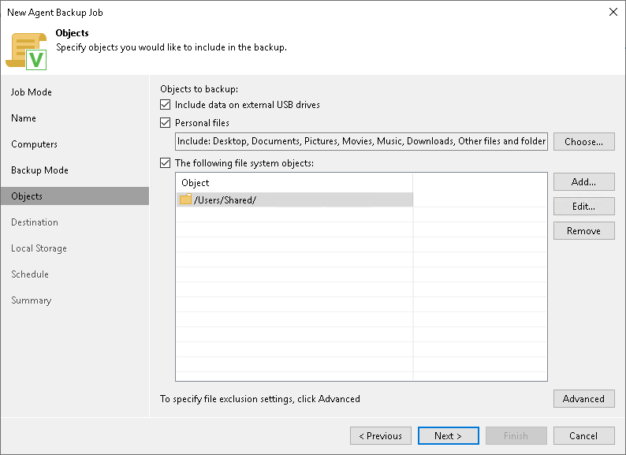
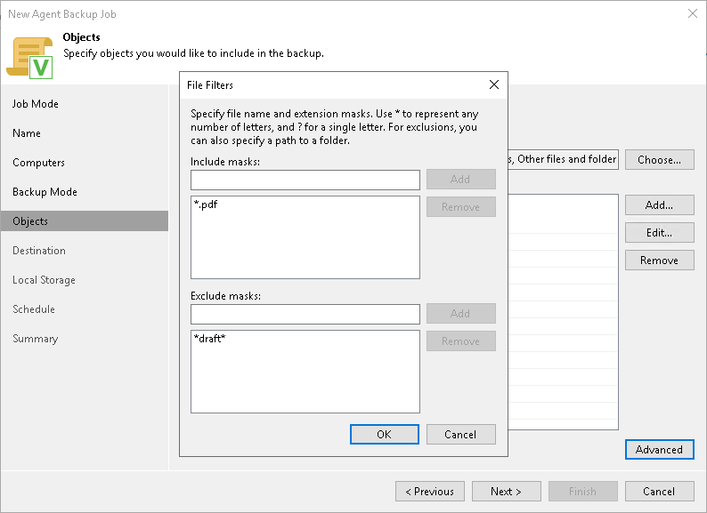

# Step 6. Specify Backup Scope Settings

The Objects step of the wizard is available if you have chosen the Custom scope mode at the [Backup Mode](agent_policy_mode_mac.md) step of the wizard.

At this step of the wizard, you must specify the backup scope — define what folders with files you want to include in the backup. The specified backup scope settings will apply to all computers that are added to the backup policy. If a specified folder does not exist on one or more computers in the policy, the policy will skip such folder on those computers and back up existing ones.

To specify the backup scope, in the Objects to backup list, select check boxes next to necessary objects. You can include the following data in the backup:

* Include data on external USB drives — data residing on an external USB drive. The USB drive must be mounted to a location within the Users folder. You can include user data from one or more USB drives connected to the Veeam Agent computer at the time when the backup job starts on the protected computer.
* Personal files — data related to user profiles. With this option enabled, Veeam Backup & Replication will include in the backup scope settings and data related to Veeam Agent computer user profiles. To learn more, see the [Protecting User Profiles Data](https://helpcenter.veeam.com/docs/agentformac/userguide/backup_job_scope.html?ver=13#protecting-user-profiles-data) section in the Veeam Agent for Mac User Guide.
* Individual file system objects — directories, mount points, and volumes of a protected computer.

To specify individual folders to back up:

1. Select the The following file system objects check box and click Add.
2. In the Add Object window, type the path to a folder, mount point folder, or volume that you want to back up, for example, /Users/Shared/ or /Users/Administrator/Documents/, and click OK.
3. Repeat steps 1–2 for all items that you want to back up.

|  |
| --- |
| TIP |
| If you want to back up the root folder and specify / in the Path to a directory field, Veeam Agent does not automatically include remote mount points in the backup scope. To include remote mount points, you need to specify paths to these mount points manually.  For example, you have a file system mounted to the /Library/Media folder. If you add / as an object to the backup scope, Veeam Agent will not back up the mounted file system. To back up the root folder and the mounted file system, add the following objects to the backup scope:   * / * /Library/Media |

Configuring Filters

To include or exclude files of a specific type in/from the file-level backup, you can configure filters.

To configure a filter:

1. At the Objects step of the wizard, click Advanced.
2. Specify what files you want to back up:

* In the Include masks field, specify file names and masks for file types that you want to back up, for example, Report.pdf or \*filename\*. Veeam Agent will create a backup only for selected files. Other files will not be backed up.
* In the Exclude masks field, specify file names and masks for file types that you do not want to back up, for example, OldReports.tar.gz or \*.odt. Veeam Agent will back up all files except files of the specified type.

1. Click Add.
2. Repeat steps 2–3 for each mask that you want to add.

You can use a combination of include and exclude masks. Note that exclude masks have a higher priority than include masks. For example, you can specify masks in the following way:

* Include mask: \*.pdf
* Exclude mask: \*draft\*

Veeam Agent will include in the backup all files of the PDF format that do not contain draft in their names.

