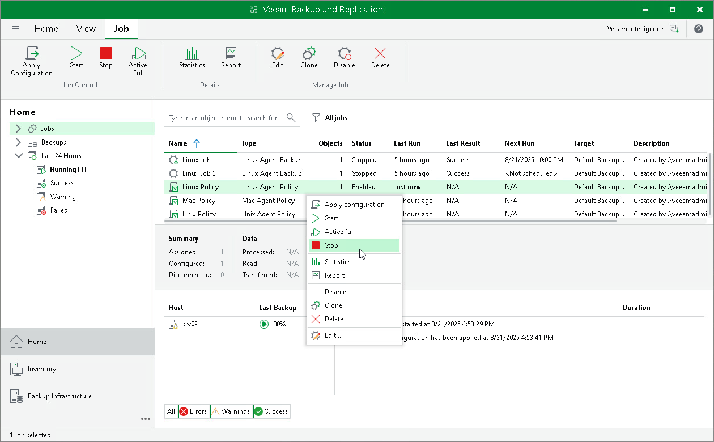

# Starting and Stopping Backup

In this article

You can manually start backup on Veeam Agent computers added to the backup policy, for example, if you want to create an additional restore point in the backup chain and do not want to change the backup schedule. You can also stop the backup process, for example, if processing of a Veeam Agent computer is about to take long, and you do not want the backup process to produce load on the production environment during business hours.

When you start the backup process for a backup policy, Veeam Backup & Replication applies the policy to Veeam Agent computers and sends a command to start backup jobs on these computers.

When you stop the backup process for a backup policy, Veeam Backup & Replication does not apply the policy to Veeam Agent computers and immediately sends a command to stop backup jobs on these computers.

Veeam Backup & Replication does not check whether connection to Veeam Agent computers is active at the time when the command is sent. Keep in mind that the start or stop operation will be performed only on those computers that received the command from the backup server.

Keep in mind that you cannot start or stop the backup process for protection groups for pre-installed Veeam Agents and their members. Veeam Agent computers included in such protection groups will be skipped and Veeam Backup & Replication will display a warning message in a backup policy session statistics.

Starting Backup

To start backup on Veeam Agent computers added to the backup policy:

1. Open the Home view.
2. In the inventory pane, select Jobs.
3. In the working area, select the backup policy and click Start on the ribbon or right-click the job and select Start.

|  |
| --- |
| TIP |
| You can also start a Veeam Agent backup job directly on a protected computer from the Veeam Agent user interface. |

Stopping Backup

To stop backup on Veeam Agent computers added to the backup policy:

1. Open the Home view.
2. In the inventory pane, select Jobs.
3. In the working area, select the backup policy and click Stop on the ribbon or right-click the job and select Stop. In the displayed window, click Yes.

Page updated 8/21/2025

Page content applies to build 13.0.1.1071
