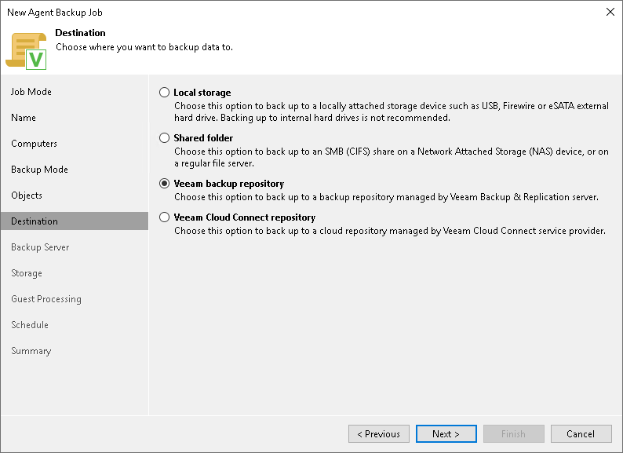

# Step 7. Select Backup Destination

In this article

At the Destination step of the wizard, select a target location for backups created by Veeam Agents installed on protected computers.

You can store backup files in one of the following locations:

* Local storage — select this option if you want to save a backup on a removable storage device attached to a protected computer or on a local drive of a protected computer. With this option selected, you will pass to the [Local Storage](agent_policy_linux_drive.md) step of the wizard.

|  |
| --- |
| IMPORTANT |
| It is recommended that you store backups in the external location like USB storage device or network shared folder. You can also keep your backup files on the separate non-system local drive. |

* Shared folder — select this option if you want to save a backup in a network shared folder. With this option selected, you will pass to the [Shared folder](agent_policy_linux_share.md) step of the wizard.
* Veeam backup repository — select this option if you want to save a backup in a backup repository managed by the Veeam backup server. With this option selected, you will pass to the [Backup Server](agent_policy_linux_vbr.md) step of the wizard.

* Veeam Cloud Connect repository — select this option if you want to save a backup on a cloud repository exposed to you by the Veeam Cloud Connect service provider. With this option selected, you will pass to the [Storage](agent_policy_linux_cloud.md) step of the wizard.

Page updated 11/4/2025

Page content applies to build 13.0.1.1071
