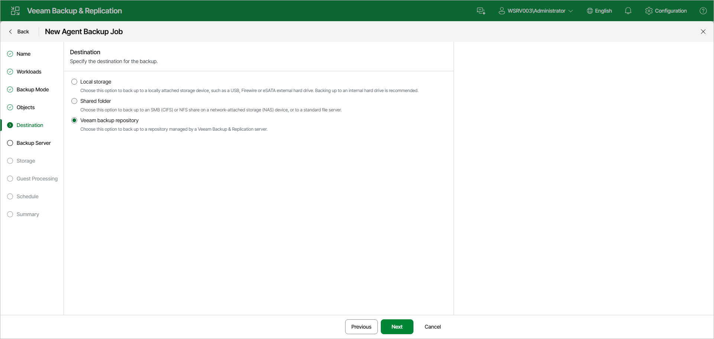

# Step 7. Select Backup Destination

At the Destination step of the wizard, select a target location for backups created by Veeam Agents installed on protected computers.

You can store backup files in one of the following locations:

* Local storage — select this option if you want to save a backup on a removable storage device attached to a protected computer or on a local drive of a protected computer. With this option selected, you will pass to the [Local Storage](agent_policy_linux_drive_web.md) step of the wizard.

|  |
| --- |
| IMPORTANT |
| It is recommended that you store backups in the external location like USB storage device or network shared folder. You can also keep your backup files on the separate non-system local drive. |

* Shared folder — select this option if you want to save a backup on an SMB (CIFS) or NFS share on a network-attached storage (NAS) device, or on a standard file server. With this option selected, you will pass to the [Shared folder](agent_policy_linux_share_web.md) step of the wizard.
* Veeam backup repository — select this option if you want to save a backup in a backup repository managed by the Veeam Backup & Replication server on which the Veeam Agent backup policy is configured. With this option selected, you will pass to the [Backup Server](agent_policy_linux_vbr_web.md) step of the wizard.

Page updated 2026-07-17

