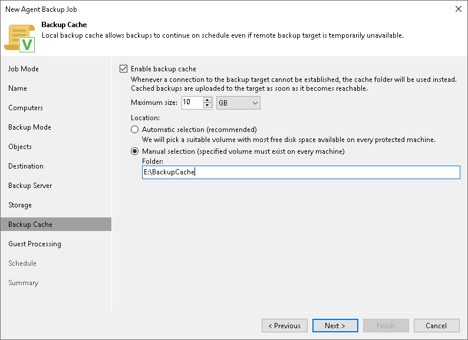

# Step 11. Specify Backup Cache Settings

In this article

The Backup Cache step of the wizard is available if you selected Veeam backup repository or Veeam Cloud Connect repository at the [Destination](agent_policy_win_destination.md) step of the wizard.

To specify backup cache settings:

1. Select the Enable backup cache check box.
2. In the Maximum size field, specify the size for the backup cache.

When defining the size of the backup cache, assume the following:

* Each full backup file may consume about 50% of the backed-up data size.
* Each incremental backup file may consume about 10% of the backed-up data size.

1. In the Location section, specify where Veeam Agent for Microsoft Windows will create the backup cache. You can select from the following options:

* Automatic selection — select this option if you want to let Veeam Agent pick a location for the backup cache automatically. On every computer added to the backup policy, Veeam Agent will detect a volume with the largest amount of free disk space and create the backup cache in the Veeam Backup Cache folder on this volume. To learn more, see [Backup Cache](agents_backup_cache.md).
* Manual selection — select this option if you want to specify a location for the backup cache manually. If you select this option, in the Folder field, specify a path to the folder on a protected computer in which backup files must be stored.

Page updated 11/4/2025

Page content applies to build 13.0.1.1071
