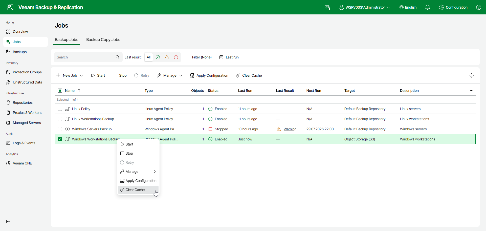

# Step 10. Specify Backup Cache Settings

The Backup Cache step of the wizard is available if you selected Veeam backup repository at the [Destination](agent_policy_win_destination_web.md) step of the wizard.

Local backup cache allows backups to run on schedule even if a remote backup repository is temporarily unavailable. To learn more, see [Backup Cache](agents_backup_cache.md).

To specify backup cache settings:

1. Turn on the Enable backup cache toggle. Whenever a connection to the backup repository cannot be established, the backup cache folder is used instead. Cached backups are uploaded to the repository as soon as it becomes reachable.
2. In the Maximum size field, specify the size for the backup cache and select the size unit in the drop-down list.

When defining the size of the backup cache, assume the following:

* Each full backup file may consume about 50% of the backed-up data size.
* Each incremental backup file may consume about 10% of the backed-up data size.

1. Under Location, from the drop-down list, specify where Veeam Agent for Microsoft Windows will create the backup cache:

* Automatic selection — select this option if you want to let Veeam Agent pick a location for the backup cache automatically. On every computer added to the backup policy, Veeam Agent will detect a volume with the largest amount of free disk space and create the backup cache in the Veeam Backup Cache folder on this volume.
* Manual selection — select this option if you want to specify a location for the backup cache manually. In the Specify the path to the backup cache folder field, specify a path to the folder on a protected computer in which cached backup files must be stored. The specified path must be available on every machine protected by this backup policy. If the specified path does not exist on one or more computers in the backup policy, Veeam Backup & Replication will fail to apply the policy to these computers.

Page updated 2026-07-16

