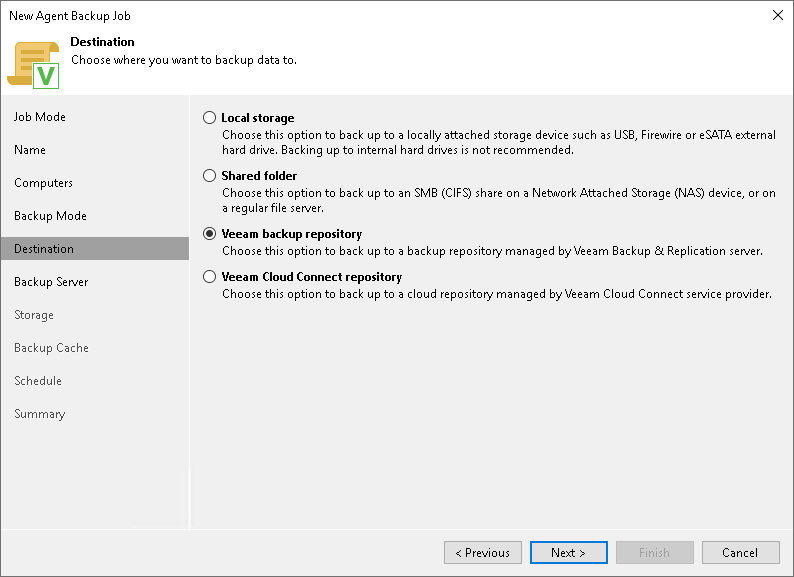

# Step 7. Select Backup Destination

In this article

At the Destination step of the wizard, select a target location for backups created by Veeam Agents installed on protected computers.

You can store backup files in one of the following locations:

* Local storage — select this option if you want to save a backup on a removable storage device attached to a protected computer or on a local drive of a protected computer. With this option selected, you will pass to the [Local Storage](agent_policy_win_target_drive.md) step of the wizard.

|  |
| --- |
| IMPORTANT |
| Consider the following:   * It is strongly recommended that you store backups in the external location like USB storage device or network shared folder. You can also keep your backup files on the separate non-system local drive. * If you select to store the backup in a local folder included in the backup scope, Veeam Agent for Microsoft Windows will automatically exclude this folder from the backup. |

* Shared folder — select this option if you want to save a backup in an SMB network shared folder. With this option selected, you will pass to the [Shared folder](agent_policy_win_target_share.md) step of the wizard.
* Veeam backup repository — select this option if you want to save a backup in a backup repository managed by the Veeam backup server of which the Veeam Agent backup policy is configured. With this option selected, you will pass to the [Backup Server](agent_policy_win_target_vbr.md) step of the wizard.
* Veeam Cloud Connect repository — select this option if you want to save a backup in a cloud repository exposed to you by the Veeam Cloud Connect service provider. With this option selected, you will pass to the [Storage](agent_policy_win_target_cloud.md) step of the wizard.

Page updated 11/4/2025

Page content applies to build 13.0.1.1071
