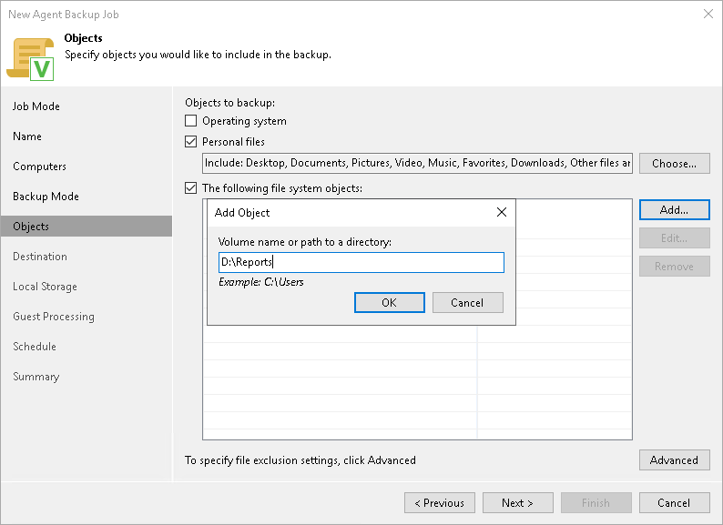
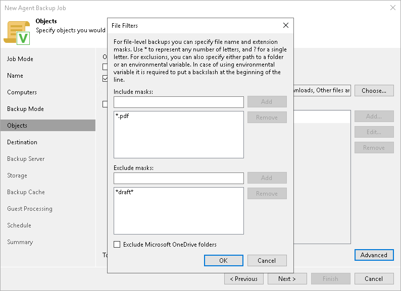

# Specifying Folders to Back Up

The Objects step of the wizard is available if you have selected the File level backup option at the [Backup Mode](agent_policy_win_mode.md) step of the wizard.

In the file-level backup mode, you can create two types of backups:

* File-level backup that includes individual folders on your computer.
* Hybrid backup that contains individual folders and specific volumes of your computer.

At this step of the wizard, you must specify the backup scope by defining what folders with files or entire volumes you want to include in the backup. The specified backup scope settings will apply to all computers that are added to the backup policy. If a specified object does not exist on one or more computers in the policy, the policy will skip such object on those computers and back up existing ones.

To specify the backup scope, in the Objects to backup list, select check boxes next to necessary objects. You can include the following data in the backup:

* Operating system — data related to the OS installed on a protected computer. To learn more, see the [System State Data Backup](https://helpcenter.veeam.com/docs/agentforwindows/userguide/system_state_backup.html?ver=13) section in the Veeam Agent for Microsoft Windows User Guide.
* Personal files — data related to user profiles. With this option enabled, Veeam Backup & Replication will include in the backup scope settings and data related to Veeam Agent computer user profiles. To learn more, see the [Personal Data Backup](https://helpcenter.veeam.com/docs/agentforwindows/userguide/personal_files_backup.html?ver=13) section in the Veeam Agent for Microsoft Windows User Guide.
* Individual file system objects — folders, mount points, and volumes of a protected computer.

To specify individual folders to back up:

1. Select the The following file system objects check box and click Add.
2. In the Add Object window, type the path to a folder, mount point folder, or volume that you want to back up, for example, D:\Reports or D:\, and click OK.

To specify the backup scope, you can use system environment variables such as %ProgramFiles% or %WinDir%. This may be useful, for example, in case computers added to the backup policy run different versions of Microsoft Windows OSes, and actual paths to directories that contain data of the same type differ on these computers.

Consider the following:

* You can use only system environment variables — variables defined for the Local System account on computers added to the backup policy. User-dependent environment variables are not supported.

* Environment variables that contain multiple values (such as the %PATH% variable) are not supported.
* Environment variables that contain other environment variables are not supported.

1. Repeat steps 1–2 for all items that you want to back up.

|  |
| --- |
|  NOTE |
| Consider the following:   * If you include a system volume in the file-level backup, Veeam Agent does not automatically include the System Reserved/UEFI or other system partitions in the backup. These volumes are automatically included in the backup only if you select the Operating system option to specify the backup scope. * Veeam Agent automatically adds to the list of exclusions the following Microsoft Windows objects for all computer users: temporary files folder, Recycle Bin, Microsoft Windows pagefile, hibernate file and VSS snapshot files from the System Volume Information folder. * You can exclude Microsoft OneDrive folders from the backup scope in the [File Filters window](#onedrive). |

Configuring Filters

To include or exclude folders and files of a specific type in/from the file-level backup, you can configure filters.

|  |
| --- |
|  NOTE |
| Consider the following:   * If you include a specific folder in the file-level backup, Veeam Agent applies filters to files in specific folders that you include in the backup. Filters are not applied to computer volumes, mount points, and folders selected for backup. If you plan to create a hybrid backup that will contain volumes, mount points, and folders, filters will be applied to files in folders only. * If you include a whole volume in the file-level backup, you cannot apply filters to include or exclude files of a specific type in/from the backup. You can only exclude specific folders that reside on the volume. * You cannot apply filters to files and folders that reside on the mount point. * If you want to include or exclude files in/from the file-level backup, you can use file names and masks for file types as filters. You cannot use paths to files. |

To configure a filter:

1. At the Objects step of the wizard, click Advanced.
2. Specify what files you want to back up:

* If you include a specific folder in the file-level backup, in the Include masks field, specify file names and masks for file types that you want to back up, for example, MyReport.pdf, \*filename\*, \*.docx. The resulting Veeam Agent backup will contain only selected files. Other files will not be backed up.

You cannot specify include masks if you add an entire volume in the backup.

* In the Exclude masks field, specify files that you do not want to back up in the following ways:

* If you include an entire volume in the file-level backup, in the Exclude masks field, specify paths to folders that contain files that you do not want to back up. The resulting Veeam Agent backup will contain all folders that reside on the backed-up volume except the files in the specified folders.

For example, you include the D:\ volume in the backup and specify the D:\Reports\OldReports folder in the Exclude masks field. The resulting backup will contain all folders and files that reside on the volume except files that reside in the D:\Reports\OldReports folder.

* If you include a specific folder in the file-level backup, in the Exclude masks field, specify paths to folders that contain files that you do not want to back up and file names and masks for file types that you do not want to back up, for example, OldReports.rar, \*.temp, \*.tmp, \*.back. The resulting Veeam Agent backup will contain all files that reside in the backed-up folder except files in the specified folders and files whose names match the specified names or masks.

Keep in mind that depending on the backup type, Veeam Agent excludes files and folders from the backup scope differently:

* For the volume-level backup, content of folders you do not want to back up is excluded from the VSS snapshot with the FilesNotToSnapshot registry key.
* For the file-level backup, folders and files are excluded by Veeam Agent after the VSS snapshot is created.

As a result, some objects may be excluded or not excluded from the backup scope depending on the type of the created backup. For example, if you configure a volume-level backup, the objects that you excluded may stay in the backup scope due to the FilesNotToSnapshot registry key limitations. To learn more, see [this Microsoft article](https://docs.microsoft.com/en-us/windows/win32/vss/excluding-files-from-shadow-copies).

1. Click Add.
2. Repeat steps 2–3 for each mask that you want to add.

|  |
| --- |
|  TIP |
| You can also use system environment variables to specify include and exclude masks. In this case, you must type the back slash (\) symbol in the beginning of the mask. For example: \%appdata%.  Consider the following:   * To specify include and exclude masks, you can use only system environment variables — variables defined for the Local System account on computers added to the backup policy, and cannot use user environment variables. For example, if you specify the \%appdata% exclude mask, Veeam Agent will exclude the C:\Windows\system32\config\systemprofile\AppData\Roaming folder from the backup. Application data directories for other user accounts (for example, C:\Users\Administrator\AppData\Roaming) will not be excluded from the backup. * You cannot use environment variables that contain multiple values or other environment variables to specify include and exclude masks. |

You can use a combination of include and exclude masks. Note that exclude masks have a higher priority than include masks. For example, you can specify masks in the following way:

* Include mask: \*.pdf
* Exclude mask: \*draft\*

The resulting Veeam Agent backup will contain all files of the PDF format that do not contain draft in their names.

Additionally, you can specify how Veeam Agent for Microsoft Windows will process Microsoft OneDrive folders. Select the Exclude Microsoft OneDrive folders option to exclude Microsoft OneDrive folders and their content from the backup scope.

Consider the following limitation:

* Veeam Agent excludes Microsoft OneDrive folders only in file-level backups. If you include an entire volume in the backup, Veeam Agent will not exclude Microsoft Onedrive folders from this volume.
* Due to the OS limitations, the Exclude Microsoft OneDrive folders option behaves properly only on Veeam Agent computers running Microsoft Windows 10. If your Veeam Agent computers run other OS versions, we recommend to exclude Microsoft OneDrive folders manually.

