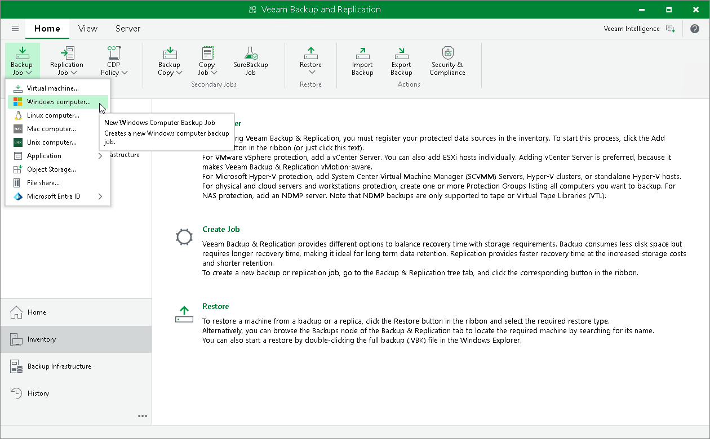

# Step 1. Launch New Agent Backup Job Wizard

In this article

You can create a Veeam Agent backup policy for protected computers that run a Microsoft Windows OS in one of the following ways:

* [Create a new backup policy](#simple) — in this case, Veeam Backup & Replication will launch the New Agent Backup Job wizard. You will be able to specify protection groups, individual Active Directory objects and Veeam Agent computers to which the backup policy settings must apply at the [Computers](agent_job_protection_mode.md) step of the wizard.
* [Add a protection group to a new backup policy](#group) — in this case, Veeam Backup & Replication will launch the New Agent Backup Job wizard and add the selected protection group to the backup policy. You will also be able to change the list of Veeam Agent computers to which the backup policy settings must apply at the [Computers](agent_job_protection_mode.md) step of the wizard.
* [Add individual computers to a new backup policy](#computers) — in this case, Veeam Backup & Replication will launch the New Agent Backup Job wizard and add the selected computers to the backup policy. You will also be able to change the list of Veeam Agent computers to which the backup policy settings must apply at the [Computers](agent_job_protection_mode.md) step of the wizard.

Launching Backup Job Wizard

To launch the New Agent Backup Job wizard, do either of the following:

* On the Home tab, click Backup Job > Windows computer.
* Open the Home view. Select the Jobs node and click Backup Job > Windows computer on the ribbon.
* Open the Home view. Right-click the Jobs node and select Backup > Windows computer.

Adding Protection Group to New Backup Policy

To add a protection group to a new Veeam Agent backup policy, do either of the following:

* Open the Inventory view. In the Physical and Cloud Infrastructure node, right-click the protection group that you want to add to the backup policy and select Add to backup job > Windows > New job.
* Open the Inventory view. In the Physical and Cloud Infrastructure node, select the protection group that you want to add to the backup policy and click Add to Backup > Windows > New job on the ribbon.

Veeam Backup & Replication will start the New Agent Backup Job wizard and add the protection group to the policy. You can add other protection groups and individual computers to the policy later on, when you pass through the wizard steps.

Adding Computers to New Backup Policy

To add specific computers to a new Veeam Agent backup policy, do either of the following:

* Open the Inventory view. In the Physical and Cloud Infrastructure node, click the protection group whose computers you want to add to the backup policy. In the working area, select one or more computers that you want to add to the policy, right-click the selected computer and select Add to backup job > New job.

* Open the Inventory view. In the Physical and Cloud Infrastructure node, click the protection group whose computers you want to add to the backup policy. In the working area, select one or more computers that you want to add to the policy and click Add to Backup > New job on the ribbon.

Veeam Backup & Replication will start the New Agent Backup Job wizard and add the selected computers to the policy. You can add other computers and protection groups to the policy later on, when you pass through the wizard steps.

|  |
| --- |
| TIP |
| Consider the following:   * You can press and hold the [Ctrl] key to select multiple computers at once. * You can add an individual computer or protection group to a Veeam Agent backup policy that is already configured in Veeam Backup & Replication. To learn more, see [Adding Computers to Backup Job](agents_protected_computers_add.md) and [Adding Protection Group to Backup Job](agents_protection_group_job.md). |

Page updated 11/12/2025

Page content applies to build 13.0.1.1071
