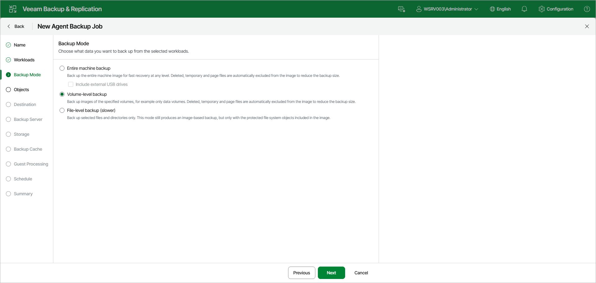

# Step 5. Select Backup Mode

At the Backup Mode step of the wizard, choose what data you want to back up from the selected workloads. You can select one of the following options:

* Entire machine backup — select this option to back up the entire machine image for fast recovery at any level. Deleted, temporary, and page files are automatically excluded from the image to reduce the backup size. With this option selected, you will pass to the [Destination](agent_policy_win_destination_web.md) step of the wizard.

If you want to include one or more external USB drives in the backup, select the Include external USB drives check box. With this option selected, Veeam Agent will include in the backup all external USB drives that are connected to the Veeam Agent computer at the time when the backup policy starts. To learn more, see the [Backup of External Drives](https://helpcenter.veeam.com/docs/agentforwindows/userguide/backup_usb.html?ver=13) section in the Veeam Agent for Microsoft Windows User Guide.

* Volume-level backup — select this option to back up images of specified volumes only, for example only data volumes. Deleted, temporary, and page files are automatically excluded from the image to reduce the backup size. With this option selected, you will pass to the [Objects](agent_policy_win_volumes_web.md) step of the wizard.
* File-level backup — select this option to back up selected files and directories only. This mode still produces an image-based backup, but only with the protected file system objects included in the image. With this option selected, you will pass to the [Objects](agent_policy_win_folders_web.md) step of the wizard.

If necessary, you can edit the backup mode settings after you create the backup policy.

|  |
| --- |
| NOTE |
| Consider the following:   * Veeam Agent for Microsoft Windows cannot back up hidden non-system volumes. * File-level backup is typically slower than volume-level backup. Depending on the performance capabilities of your computer and backup environment, the difference between file-level and volume-level backup job performance may increase significantly. If you plan to back up all folders with files on a specific volume or back up large amount of data, we recommend that you configure volume-level backup instead of file-level backup. |

Page updated 2026-07-16

