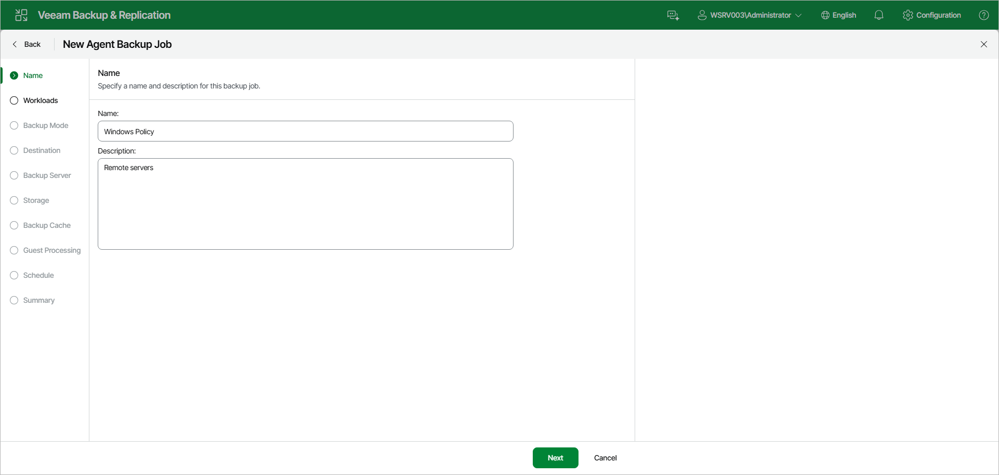

# Step 3. Specify Job Name and Description

At the Name step of the wizard, specify a name and description for the backup policy.

1. In the Name field, enter a name for the backup policy.
2. In the Description field, provide a description for future reference.

Page updated 2026-07-16

