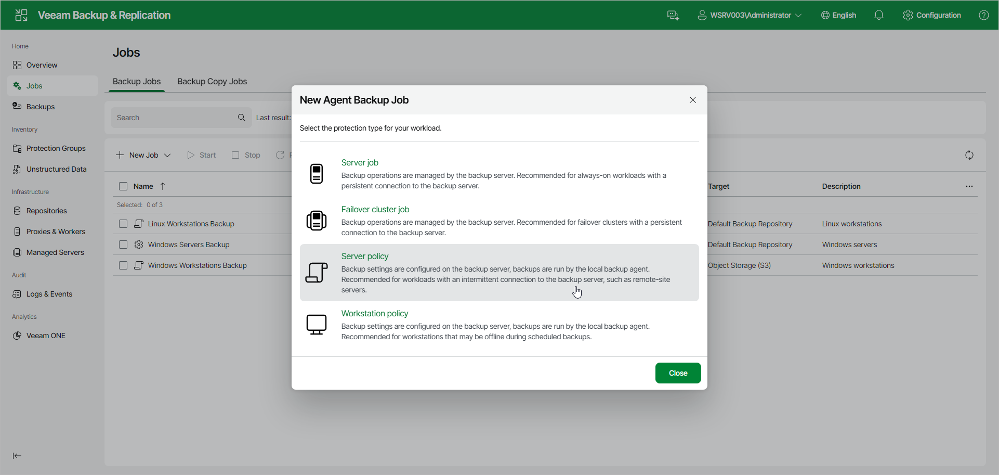

# Step 2. Select Job Mode

In the New Agent Backup Job window, select the protection type for your workload. For a Veeam Agent backup policy, select one of the following options:

* Server policy — select this option to back up data on standalone servers. This option is recommended for computers with an intermittent connection to the backup server, such as remote-site servers.

For backup policies that process servers, Veeam Backup & Replication offers settings similar to the settings of the backup job available in the Server edition of Veeam Agent for Microsoft Windows. To learn more, see the [Veeam Agent for Microsoft Windows User Guide](https://helpcenter.veeam.com/docs/agentforwindows/userguide/overview.html?ver=13).

* Workstation policy — select this option to back up data on workstations or laptops. This option is recommended for computers that may be offline during scheduled backups.

For backup policies that process workstations, Veeam Backup & Replication offers settings similar to the settings of the backup job available in the Workstation edition of Veeam Agent for Microsoft Windows. To learn more, see the [Veeam Agent for Microsoft Windows User Guide](https://helpcenter.veeam.com/docs/agentforwindows/userguide/overview.html?ver=13).

If you want to create a Veeam Agent backup job managed by the backup server, select the Server job or Failover cluster job option. To learn more, see [Creating Job for Windows Computers Using Web UI](agent_job_create_win_web.md).

Page updated 2026-07-16

