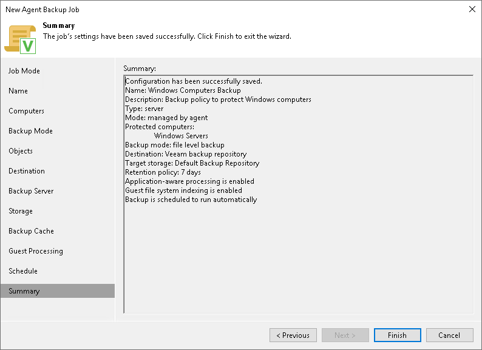

# Step 14. Review Backup Job Settings

At the Summary step of the wizard, complete the backup policy configuration process.

1. Review settings of the configured Veeam Agent backup policy.
2. Click Finish to close the wizard.

Keep in mind that Veeam Backup & Replication does not immediately apply backup policy to computers included in protection groups for pre-installed Veeam Agents. Veeam Agents installed on computers that are included in these groups connect to Veeam Backup & Replication every 6 hours and get updated backup policy settings. If you targeted a backup policy at the Veeam backup server and scheduled earlier than the next connection to Veeam Backup & Replication, this backup policy will get updated backup policy settings at the next backup policy session start. To learn more about protection groups for pre-installed Veeam Agents, see [Protection Group Types](agents_protection_groups_types.md).

If you want to apply backup policy immediately, you must synchronize Veeam Agent with Veeam Backup & Replication from the Veeam Agent computer side manually. To learn more, see [Configuration](deploy_agent_windows.md#configure).

