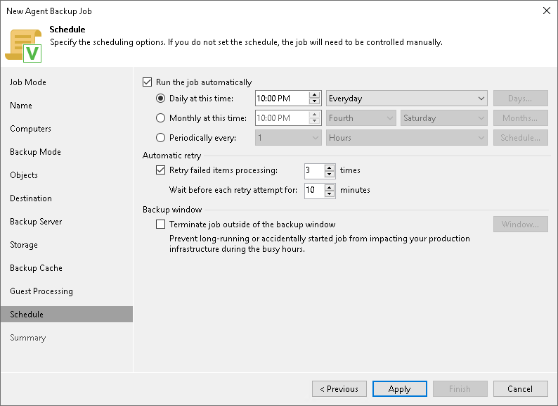

# Scheduling Settings for Servers

At the Schedule step of the wizard, specify the schedule according to which you want to perform backup.

To specify the policy schedule:

|  |
| --- |
| NOTE |
| The backup job on each Veeam Agent computer runs according to the local time of the computer. |

1. Select the Run the job automatically check box. If this check box is not selected, you will have to start the backup policy manually to create backup.
2. Define scheduling settings for the policy:

* To run the policy at specific time daily, on defined week days or with specific periodicity, select Daily at this time. Use the fields on the right to configure the necessary schedule.
* To run the policy once a month on specific days, select Monthly at this time. Use the fields on the right to configure the necessary schedule.
* To run the policy repeatedly throughout a day with a specific time interval, select Periodically every. In the field on the right, select the necessary time unit: Hours or Minutes. Click Schedule and use the time table to define the permitted time window for the policy. In the Start time within an hour field, specify the exact time when the policy must start.

A repeatedly run policy is started by the following rules:

* The defined interval always starts at 12:00 AM. For example, if you configure to run a policy with a 4-hour interval, the policy will start at 12:00 AM, 4:00 AM, 8:00 AM, 12:00 PM, 4:00 PM and so on.
* If you define permitted hours for the policy, after the denied interval is over, the policy will start immediately and then run by the defined schedule.

For example, you have configured a policy to run with a 2-hour interval and defined permitted hours from 9:00 AM to 5:00 PM. According to the rules above, the policy will first run at 9:00 AM, when the denied period is over. After that, the policy will run at 10:00 AM, 12:00 PM, 2:00 PM and 4:00 PM.

* To run the policy continuously, select the Periodically every option and choose Continuously from the list on the right. A new backup policy session will start as soon as the previous backup policy session finishes.

1. In the Automatic retry section, define whether Veeam Agent for Microsoft Windows must attempt to run the backup policy again if the policy fails for some reason. Enter the number of attempts to run the policy and define time intervals between them. If you select continuous backup, Veeam Backup & Replication or Veeam Agent for Microsoft Windows retries the policy for the defined number of times without any time intervals between the policy runs.

If a backup policy fails and Veeam Agent retries the session, Veeam Agent does not transfer all the data again. Instead, Veeam Agent continues data transfer that was started before the backup policy fail. To do so, Veeam Agent compares hash values for data blocks on source and target. After the hash comparison, Veeam Agent also transfers only those data blocks that were not transferred before the policy fail. If data blocks on source were changed before the retry, Veeam Agent transfers these data blocks as well.

|  |
| --- |
| NOTE |
| The automatic retry does not start if you run the backup policy manually. In this case, you can manually retry the backup policy. To learn more, see [Retrying Veeam Agent Backup Job](agent_job_retry.md). |

1. In the Backup window section, define the time interval within which the backup policy must complete. The backup window prevents the policy from overlapping with production hours and ensures that the policy does not impact performance of your server. To set up a backup window for the policy:

1. Select the Terminate job if it exceeds allowed backup window check box and click Window.
2. In the Time Periods window, define the allowed hours and prohibited hours for backup.

If the policy exceeds the allowed window, it will be automatically terminated. In this case, data transport and backup chain transformation processes are stopped. Keep in mind that this behavior differs from a VM backup job where backup window affects data transport process and health check operations only.

|  |
| --- |
|  IMPORTANT |
| The backup window does not affect the process of uploading backup files from the backup cache to the target storage. If Veeam Agent creates one or more backup files in the backup cache, and then the backup target becomes available, Veeam Agent uploads backup files to the target location immediately, regardless of the specified backup window. |

