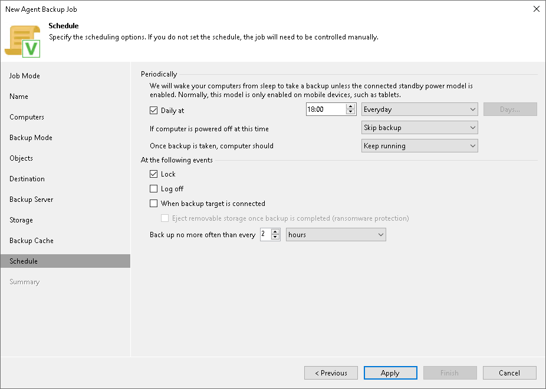

# Scheduling Settings for Workstations

In this article

At the Schedule step of the wizard, specify the schedule according to which you want to perform backup.

To specify the policy schedule:

|  |
| --- |
| NOTE |
| The backup job on each Veeam Agent computer runs according to the local time of the computer. |

1. Select the Daily at check box and use the fields on the right to specify time and days when the backup policy must start:

* Everyday — select this option to start the policy at specific time daily.
* On week-days — select this option to start the policy at specific time on week-days.
* On these days — select this option to start the policy at specific time on selected days.

You can leave the Daily at check box unchecked to configure the backup policy without daily schedule. In this case, you will be able to use the backup policy to perform backup automatically [at specific events](#events).

1. If you have selected the On these days option, click the Days button and clear check boxes for the days when the policy must not start.
2. Select the action that Veeam Agent for Microsoft Windows must perform in case the protected computer is powered off at the time when the scheduled backup policy must start.

* Backup once powered on — select this option if you want Veeam Agent for Microsoft Windows to start the scheduled backup policy when the protected computer is powered on.
* Skip backup — select this option if you want Veeam Agent for Microsoft Windows not to start the scheduled backup policy when the computer is powered on. Veeam Agent for Microsoft Windows will perform backup at the next scheduled time.

1. If you want Veeam Agent for Microsoft Windows to perform a finalizing action after the backup policy completes successfully, select the necessary action:

* Keep running — select this option if the computer must keep on working.
* Sleep — select this option if you want Veeam Agent for Microsoft Windows to bring the computer to the standby mode.
* Shutdown — select this option if you want Veeam Agent for Microsoft Windows to shut down the computer.
* Hibernate — select this option if you want Veeam Agent for Microsoft Windows to bring the computer to the hibernate mode. This option is available if the hibernate mode is enabled on the protected computer. To learn more, see [this Microsoft KB article](https://support.microsoft.com/en-us/kb/920730).

When the backup policy completes, Veeam Agent for Microsoft Windows will prompt a dialog with a countdown to the selected post-job action. You can select to proceed to the action immediately or to cancel the action. To learn more, see the [Controlling Backup Post-Job Action](https://helpcenter.veeam.com/docs/agentforwindows/userguide/post-job_activity_prompt.html?ver=13) section in the Veeam Agent for Microsoft Windows User Guide.

1. In the At the following events section, specify settings for events that trigger the backup policy launch:

* Select the Lock check box if you want to start the backup policy when the user locks the Veeam Agent computer.
* Select the Log off check box if you want to start the backup policy when the user working with the computer performs a logout operation.
* Select the When backup target is connected check box if you want to start the backup policy when the backup storage becomes available (for example, when the computer connects to a local network and the target shared folder is accessible).
* Select the Eject removable storage once backup is completed check box if you want Veeam Agent for Microsoft Windows to unmount the storage device after the backup policy completes successfully. With this option selected, backup files on the removable storage will be protected from encrypting ransomware, such as CryptoLocker.

Veeam Agent applies this setting only to backup policies triggered by the When backup target is connected event. In case of backup policies triggered by other computer events or started periodically at specific time, Veeam Agent will ignore this setting, and the storage device will not be unmounted after the backup policy completes successfully.

|  |
| --- |
|  IMPORTANT |
| The Eject removable storage once backup is completed option does not guarantee a bulletproof protection against ransomware. To ensure your backups are safe, keep the OS up to date and regularly scan your backup repository for virus threats using modern antivirus software. |

* Use the Back up no more often than every <N> <time units> field to restrict the frequency of backup policy sessions. Specify a minutely, hourly or daily interval between the backup policy sessions.

The Back up no more often than every <N> <time units> option is applied only to policy sessions started at specific events. Daily backups are performed according to defined schedule regardless of the time interval specified for this setting.

|  |
| --- |
| IMPORTANT |
| If the power scheme on the Veeam Agent computer does not allow using wake up timers, Veeam Agent for Microsoft Windows will not be able to wake your computer from sleep for backup. You can manually change the power scheme settings on the Veeam Agent computer. To do this, navigate to Control Panel > All Control Panel Items > Power Options > Edit Plan Settings. |

Page updated 11/4/2025

Page content applies to build 13.0.1.1071
