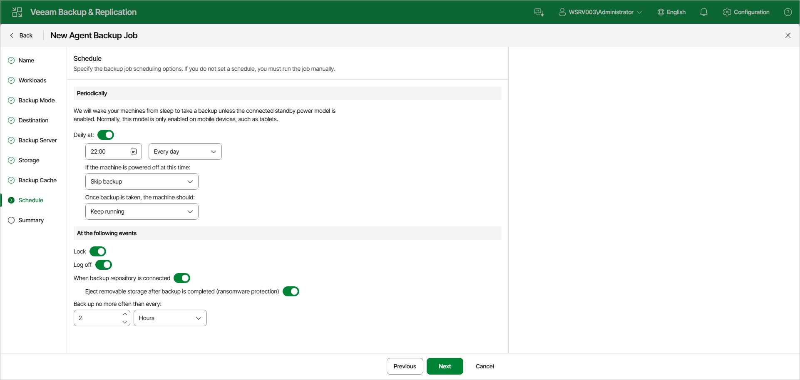

# Scheduling Settings for Workstations

At the Schedule step of the wizard, specify the schedule according to which you want to perform backup.

To specify the policy schedule:

|  |
| --- |
| NOTE |
| The backup job on each Veeam Agent computer runs according to the local time of the computer. |

1. Turn on the Daily at toggle and use the fields below to specify time and days when the backup policy must start:

* Every day — select this option to start the policy at specific time daily.
* On week-days — select this option to start the policy at specific time on week-days.
* On these days — select this option to start the policy at specific time on selected days.

You can leave the Daily at toggle off to configure the backup policy without daily schedule. In this case, you will be able to use the backup policy to perform backup automatically [at specific events](#events).

1. If the protected computer is not available when the scheduled backup policy must start — for example, if the computer is:

* Powered off.
* In sleep or hibernation mode with wake up timers disabled in the power plan settings.
* In sleep mode with the Modern Standby power model enabled.

From the If the machine is powered off at this time drop-down list, select the action that Veeam Agent for Microsoft Windows must perform:

* Backup once powered on — select this option if you want Veeam Agent for Microsoft Windows to start the missed scheduled backup run when the protected computer becomes available.
* Skip backup — select this option if you want Veeam Agent for Microsoft Windows not to start the missed scheduled backup run when the protected computer becomes available. Veeam Agent for Microsoft Windows will perform backup at the next scheduled time.

|  |
| --- |
| NOTE |
| If the Backup once powered on option is selected and a scheduled backup was missed while the computer was in Modern Standby, expect a delay of several minutes after the computer resumes before the missed backup starts. Veeam Agent for Microsoft Windows needs this time to confirm the computer has fully exited Modern Standby. |

1. From the Once backup is taken, the machine should drop-down list, select the action that Veeam Agent for Microsoft Windows must perform after the backup policy completes successfully:

* Keep running — select this option if the computer must keep on working.
* Sleep — select this option if you want Veeam Agent for Microsoft Windows to bring the computer to the standby mode.
* Shutdown — select this option if you want Veeam Agent for Microsoft Windows to shut down the computer.
* Hibernate — select this option if you want Veeam Agent for Microsoft Windows to bring the computer to the hibernate mode. This option is available if the hibernate mode is enabled on the protected computer. To learn more, see [this Microsoft KB article](https://support.microsoft.com/en-us/kb/920730).

When the backup policy completes, Veeam Agent for Microsoft Windows will prompt a dialog with a countdown to the selected post-job action. You can select to proceed to the action immediately or to cancel the action. To learn more, see the [Controlling Backup Post-Job Action](https://helpcenter.veeam.com/docs/agentforwindows/userguide/post-job_activity_prompt.html?ver=13) section in the Veeam Agent for Microsoft Windows User Guide.

1. Under At the following events, specify settings for events that trigger the backup policy launch:

* Turn on the Lock toggle if you want to start the backup policy when the user locks the Veeam Agent computer.
* Turn on the Log off toggle if you want to start the backup policy when the user working with the computer performs a logout operation.
* Turn on the When backup repository is connected toggle if you want to start the backup policy when the backup storage becomes available (for example, when the computer connects to a local network and the target shared folder is accessible).
* Turn on the Eject removable storage after backup is completed toggle if you want Veeam Agent for Microsoft Windows to unmount the storage device after the backup policy completes successfully. With this option enabled, backup files on the removable storage will be protected from encrypting ransomware, such as CryptoLocker.

Veeam Agent applies this setting only to backup policies triggered by the When backup repository is connected event. In case of backup policies triggered by other computer events or started periodically at specific time, Veeam Agent will ignore this setting, and the storage device will not be unmounted after the backup policy completes successfully.

|  |
| --- |
|  IMPORTANT |
| The Eject removable storage after backup is completed option does not guarantee a bulletproof protection against ransomware. To ensure your backups are safe, keep the OS up to date and regularly scan your backup repository for virus threats using modern antivirus software. |

1. Use the Back up no more often than every field to restrict the frequency of backup policy sessions. Specify an interval and select the time unit: Minutes, Hours or Days.

This option is applied only to policy sessions started at specific events. Daily backups are performed according to defined schedule regardless of the time interval specified for this setting.

|  |
| --- |
| IMPORTANT |
| In the following cases, Veeam Agent for Microsoft Windows will not be able to wake the computer from sleep mode for scheduled backups:   * The power scheme on the Veeam Agent computer does not allow using wake up timers. You can manually change the power scheme settings on the Veeam Agent computer. To do this, navigate to Control Panel > All Control Panel Items > Power Options > Edit Plan Settings. * The computer uses the Modern Standby power model.   On computers that use Modern Standby, Veeam Agent for Microsoft Windows detects it and adjusts behavior accordingly: it does not start scheduled backups while the computer is in Modern Standby, and it postpones going to idle sleep if a job is already running. |

Page updated 2026-07-22

