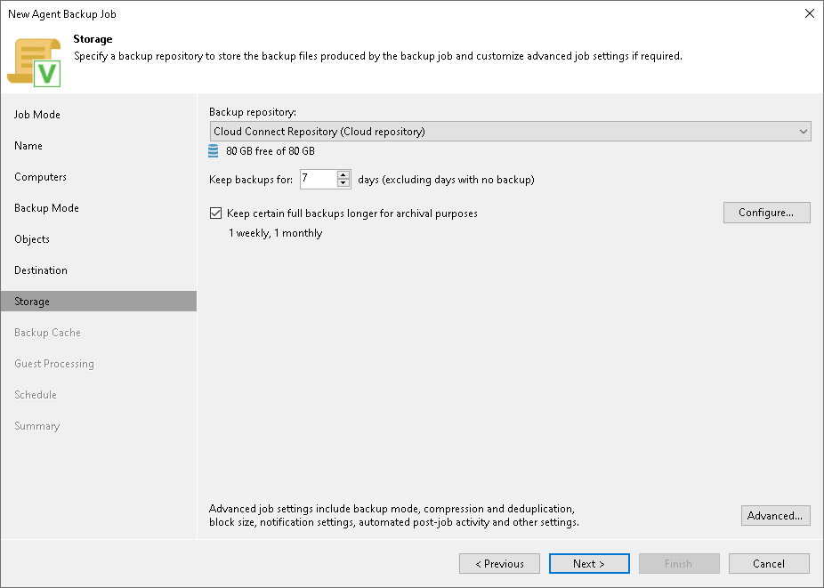

# Cloud Repository Settings

In this article

|  |
| --- |
| NOTE |
| Keep in mind that FQDN or IP addresses of Veeam Agent computers that you back up to the cloud repository will be visible to the Veeam Cloud Connect service provider. To learn more, see [Before You Begin](agents_protection_group_before.md#public_ip). |

At the Storage step of the wizard, specify settings for the cloud repository:

1. From the Backup repository list, select a cloud repository where you want to store created backups. The Backup repository list displays cloud repositories allocated to your tenant account by the Veeam Cloud Connect service provider. When you select a cloud repository, Veeam Backup & Replication automatically checks how much free space is available in the repository.
2. From the Keep backups for list, select the number of days for which you want to store backup files in the target location. By default, Veeam Backup & Replication keeps backup files for 7 calendar days, including days when backup files are not created. After this period is over, Veeam Backup & Replication removes the earliest restore points from the backup chain.

To learn more, see [Short-Term Retention Policy](agents_retention.md).

1. To use the GFS (Grandfather-Father-Son) retention scheme, select the Keep certain full backups longer for archival purposes check box and click Configure. In the Configure GFS window, specify how weekly, monthly and yearly full backups must be retained. To learn more, see [Long-Term Retention Policy (GFS)](gfs_retention_policy.md).
2. Click Advanced to specify advanced settings for the backup job. To learn more, see [Specify Advanced Backup Settings](agent_job_advanced.md).

|  |
| --- |
| IMPORTANT |
| You must enable backup file encryption in the [backup job storage settings](agent_job_advanced_storage.md) if you back up data to the Veeam Data Cloud Vault storage added as a Veeam Cloud Connect repository. |

Related Topics

[Backup to Veeam Cloud Connect Repository](agents_cloud_connect.md)

Page updated 11/12/2025

Page content applies to build 13.0.1.1071
