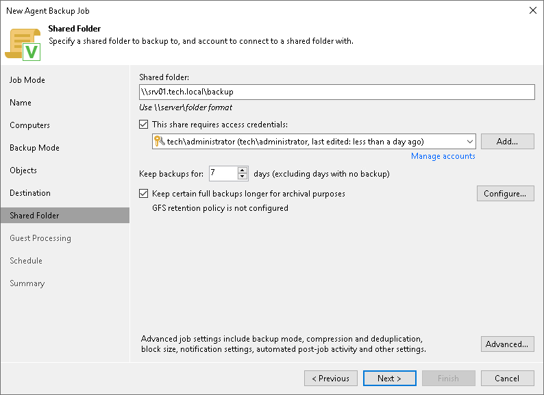

# Shared Folder Settings

In this article

At the Shared Folder step of the wizard, specify shared folder settings:

1. In the Shared folder field, type a UNC name of the SMB network shared folder in which you want to store backup files. Keep in mind that the UNC name always starts with two back slashes (\\).
2. If the SMB network shared folder requires authentication, select the This share requires access credentials check box and select from the list a user account that has access permissions on this shared folder. If you have not set up credentials beforehand, click the Manage accounts link or click Add on the right to add credentials.

The user name can be specified in the following formats:

* DNS.DOMAIN.NAME\USERNAME
* USERNAME@DNS.DOMAIN.NAME
* HOSTNAME\USERNAME — if you use Veeam Backup & Replication on Microsoft Windows
* DOMAIN\USERNAME — if you use Veeam Backup & Replication on Microsoft Windows

If you do not select the This share requires access credentials check box, Veeam Agent for Microsoft Windows will connect to the shared folder using the NT AUTHORITY\SYSTEM account of the computer where the product is installed. You can use this scenario if the Veeam Agent computer is joined to the Active Directory domain. In this case, you can simply grant Full Control access on the shared folder and underlying file system to the computer account (DOMAIN\COMPUTERNAME$).

1. From the Keep backups for list, select the number of days for which you want to store backup files in the target location. By default, Veeam Backup & Replication keeps backup files for 7 calendar days, including days when backup files are not created. After this period is over, Veeam Backup & Replication removes the earliest restore points from the backup chain. To learn more, see [Short-Term Retention Policy](agents_retention.md).
2. To use the GFS (Grandfather-Father-Son) retention scheme, select the Keep certain full backups longer for archival purposes check box and click Configure. In the Configure GFS window, specify how weekly, monthly and yearly full backups must be retained. To learn more, see [Long-Term Retention Policy (GFS)](gfs_retention_policy.md).

Keep in mind that to use the GFS retention policy, you must set Veeam Agent to create full backups. To learn more, see [Backup Settings](agent_job_advanced_backup.md).

1. Click Advanced to specify advanced settings for the backup policy. To learn more, see [Specify Advanced Backup Settings](agent_job_advanced.md).

Page updated 11/5/2025

Page content applies to build 13.0.1.1071
