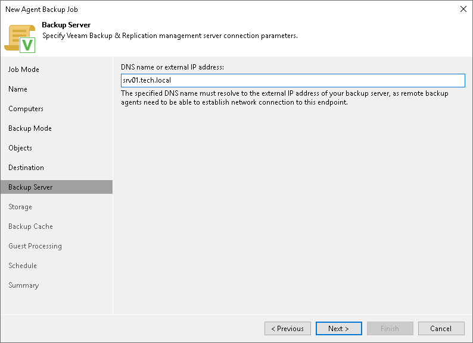

# Veeam Backup Repository Settings

In this article

If you have chosen to store backup files in a Veeam backup repository, specify settings to connect to the backup repository:

1. [At the Backup Server step of the wizard, specify backup server settings](#vbr).
2. [At the Storage step of the wizard, select the Veeam backup repository](#repo).

Specifying Backup Server Settings

The Backup Server step of the wizard is available if you have chosen to store backup files in a Veeam backup repository.

In the DNS name or external IP address field, make sure that the name or IP address of the Veeam backup server, on which you configure the Veeam Agent backup policy, is displayed. Do not specify the name or IP address of another Veeam backup server. The specified DNS name or IP address must be resolvable from Veeam Agent computers.

|  |
| --- |
| IMPORTANT |
| Consider the following:   * Veeam Backup & Replication does not automatically update information about the backup server in the backup policy settings after migration of the configuration database. After you migrate configuration data to a new location, you must specify the name or IP address of the new backup server in the properties of all backup policies configured in Veeam Backup & Replication. * If you enable the High Availability (HA) cluster in your backup infrastructure, you cannot modify the displayed DNS name or external IP address. The backup server information is automatically populated with the HA cluster details. Any existing policies created before enabling HA will automatically have this setting updated.   To learn more, see [High Availability (HA) Cluster](high_availability_cluster.md). |

Selecting Backup Repository

The Storage step of the wizard is available if you have chosen to save backup files in a Veeam backup repository.

Specify settings for the target backup repository:

1. From the Backup repository list, select a backup repository where you want to store created backups. When you select a backup repository, Veeam Backup & Replication automatically checks how much free space is available on the backup repository.
2. From the Keep backups for list, select the number of days for which you want to store backup files in the target location. By default, Veeam Backup & Replication keeps backup files for 7 calendar days, including days when backup files are not created. After this period is over, Veeam Backup & Replication removes the earliest restore points from the backup chain.
3. To use the GFS (Grandfather-Father-Son) retention scheme, select the Keep certain full backups longer for archival purposes check box and click Configure. In the Configure GFS window, specify how weekly, monthly and yearly full backups must be retained. To learn more, see [Long-Term Retention Policy (GFS)](gfs_retention_policy.md).
4. If you want to archive backup files created with the backup job to a secondary destination (backup repository or tape), select the Configure secondary destinations for this job check box. With this option enabled, the New Agent Backup Job wizard will include an additional step — [Secondary Target](agent_job_secondary_target.md). At the Secondary Target step of the wizard, you can link the backup job to the backup copy job or backup to tape backup job.

You can enable this option only if a backup copy job or backup to tape job is already configured on the backup server.

1. Click Advanced to specify advanced settings for the backup policy. To learn more, see [Specify Advanced Backup Settings](agent_job_advanced.md).

|  |
| --- |
| NOTE |
| You must enable backup file encryption in the [backup job storage settings](agent_job_advanced_storage.md) if you back up data to the Veeam Data Cloud Vault storage added as a Veeam backup repository. |

Page updated 12/2/2025

Page content applies to build 13.0.1.1071
