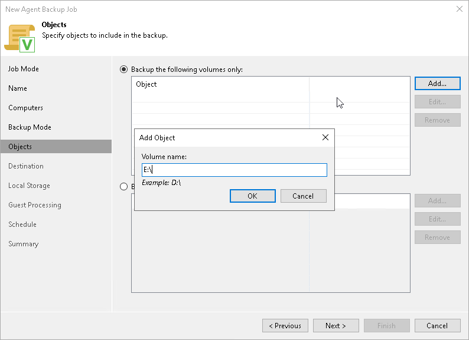

# Specifying Volumes to Back Up

The Objects step of the wizard is available if you have selected the Volume level backup option at the [Backup Mode](agent_policy_win_mode.md) step of the wizard.

At this step of the wizard, you must specify the backup scope — define what volumes you want to include in the backup. The specified backup scope settings will apply to all computers that are added to the backup policy. If a specified volume does not exist on one or more computers in the policy, the policy will skip such volume on those computers and back up only existing ones.

To specify the backup scope, you can select the Backup the following volumes only option and add necessary objects.

Alternatively, you can back up the whole Veeam Agent computer. To do this, select the Backup all volumes except the following option. With this option selected, you can exclude objects that you do not need from the backup scope.

You can include or exclude the following objects:

* OS volume — data on the OS installed on a protected computer. This object includes the Microsoft Windows system partition and boot partition of your computer. For GPT disks on Microsoft Windows Server 2012 R2, 2016, 2019, 2022 and 2025, the object additionally includes the recovery partition. To learn more, see the [System State Data Backup](https://helpcenter.veeam.com/docs/agentforwindows/userguide/system_state_backup.html?ver=13) section in the Veeam Agent for Microsoft Windows User Guide.

To include or exclude the OS volume, in the necessary wizard section, click Add and select the OS volume option.

* Individual volumes.

To include or exclude individual volumes:

1. In the necessary wizard section, click Add and select the Volume name option.
2. In the Add Object window, type the drive letter of a volume that you want to back up, for example, C:\, and click OK.
3. Repeat steps a–b for all volumes that you want to back up.

* Individual mount points.

To include or exclude individual mount points:

1. In the necessary wizard section, click Add and select the Volume name option.
2. In the Add Object window, type the path to a folder that is an entry point to the mounted volume you want to back up, for example, C:\Data, and click OK.
3. Repeat steps a–b for all mount points that you want to back up.

|  |
| --- |
| NOTE |
| Consider the following:   * If you include a system volume in the volume-level backup, Veeam Agent for Microsoft Windows automatically includes the System Reserved/UEFI or other system partitions in the backup too. * You cannot include volumes located on virtual hard disks (VHD or VHDX) in the volume-level backup.  * Veeam Agent for Microsoft Windows cannot back up hidden non-system volumes.  * Veeam Agent for Microsoft Windows automatically adds to the list of exclusions the following Microsoft Windows objects for all computer users: temporary files folder, Recycle Bin, Microsoft Windows pagefile, hibernate file and VSS snapshot files from the System Volume Information folder. |

