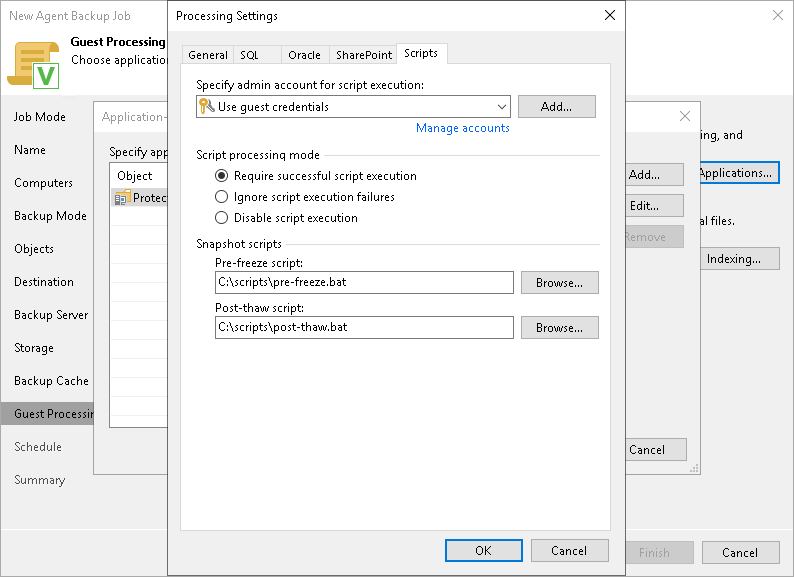

# Pre-Freeze and Post-Thaw Scripts

In this article

If you plan to back up data of applications that do not support VSS, you can specify what scripts Veeam Agent for Microsoft Windows must use to quiesce the OS on the protected computer. The pre-freeze script quiesces the file system and application data to bring the OS to a consistent state before Veeam Agent for Microsoft Windows requests the creation of a VSS snapshot. After the VSS snapshot is created, the post-thaw script brings the file system and applications to their initial state.

To specify pre-freeze and post-thaw scripts for the policy:

1. At the Guest Processing step, make sure that the Enable application-aware processing check box is selected.
2. Click Applications.
3. In the displayed list, select a protection group or individual computer and click Edit.
4. In the Processing Settings window, click the Scripts tab.
5. From the Specify admin account for script execution list, select a user account that Veeam Agent for Microsoft Windows will use to run pre-freeze and post-thaw scripts. If you have not set up credentials beforehand, click the Manage accounts link or click Add on the right to add credentials.

By default, the Use guest credentials option is selected in the list. With this option selected, Veeam Agent for Microsoft Windows will run pre-freeze and post-thaw scripts under the account that you have specified for the protected computer in the protection group settings.

1. In the Script processing mode section, specify the scenario for scripts execution:

* Select Require successful script execution if you want Veeam Agent for Microsoft Windows to stop the backup process if the script fails.
* Select Ignore script execution failures if you want to continue the backup process even if script errors occur.
* Select Disable script execution if you do not want to run scripts.

1. In the Snapshot scripts section, in the Pre-freeze script and Post-thaw script fields, click Browse to choose executable files from a local folder on the backup server. During the backup policy session, Veeam Backup & Replication will upload the scripts to Veeam Agent computers added to the policy and execute them on these computers.

Veeam Agent for Microsoft Windows supports scripts in the .EXE, .BAT, .CMD and .PS1 formats.

You can use scripts of other formats as well, but we cannot guarantee correct processing of such scripts.

Page updated 11/21/2025

Page content applies to build 13.0.1.1071
