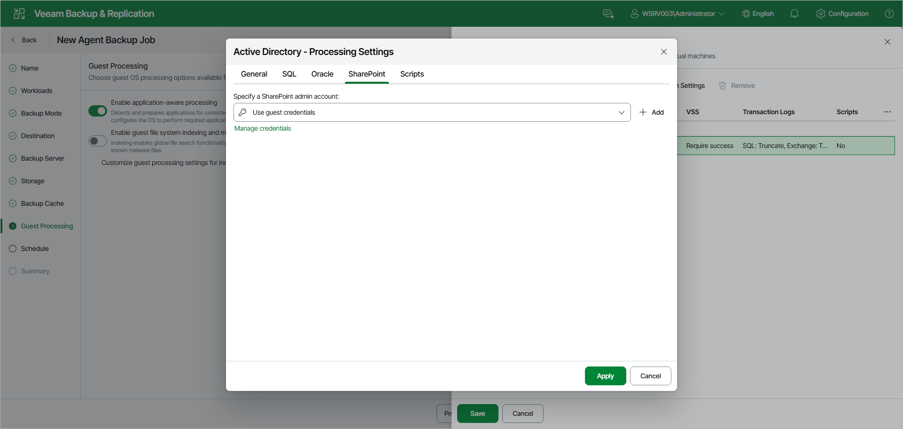

# Microsoft SharePoint Account Settings

If you back up Microsoft SharePoint, you must specify a user account that has enough permissions on the application:

1. At the Guest Processing step of the wizard, make sure that the Enable application-aware processing toggle is on.
2. Click Customize.
3. In the Customize Guest Processing Settings window, select the check box next to the protection group or individual computer and click Application Settings on the toolbar.
4. In the Processing Settings window, open the SharePoint tab.
5. From the Specify a SharePoint admin account drop-down list, select a user account configured as specified in section [Permissions for Guest Processing](agents_permissions.md#guest). If you have not set up credentials beforehand, click the Manage credentials link or click Add on the right to add credentials.

By default, the Use guest credentials option is selected. With this option selected, Veeam Agent for Microsoft Windows will connect to the SharePoint application under the account that you have specified for the protected computer in the protection group settings.

Page updated 2026-07-16

