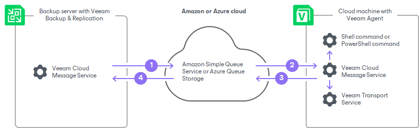

# Backup of Cloud Machines

To back up data of Amazon EC2 instances or Microsoft Azure virtual machines (both objects can be also referred to as cloud machines), you can use Veeam Agent for Microsoft Windows or Veeam Agent for Linux together with Veeam Backup & Replication. Veeam Backup & Replication allows you to discover cloud machines and deploy Veeam Agents using cloud native API instead of the connection over network.

Veeam Backup & Replication supports backup of the following cloud machines:

* Amazon EC2 instances
* Microsoft Azure virtual machines

You can back up cloud machines running Microsoft Windows or Linux OSes that are supported by Veeam Agent and by cloud service provider.

* To learn lists of OSes supported by Veeam Agent, see system requirements [for Veeam Agent for Microsoft Windows](agents_system_requirements_windows.md#vaw) or [for Veeam Agent for Linux](agents_system_requirements_linux.md#val) depending on the type of Veeam Agent you plan to use.
* To learn lists of OSes supported by cloud service provider, see [AWS documentation](https://docs.aws.amazon.com/systems-manager/latest/userguide/prereqs-operating-systems.html) or [Microsoft documentation](https://learn.microsoft.com/en-us/troubleshoot/azure/virtual-machines/support-extensions-agent-version) depending on the type of cloud machines you plan to protect.

Considerations and Limitations

Consider the following about backing up cloud machines:

* On machines running Microsoft Windows, Windows PowerShell 5.1 or later must be installed.
* You cannot install Veeam Agent for Linux on UEFI-based cloud machines with Secure Boot enabled.

Getting Started

To back up cloud machine data, you must complete the following steps:

1. Add a Microsoft Azure blob storage or Amazon S3 storage to your infrastructure depending on the type of cloud machines you plan to protect. To learn more, see [Adding Azure Blob Storage](osr_adding_blob_storage.md) or [Adding Amazon S3 Storage](osr_amazon_adding.md).

|  |
| --- |
| NOTE |
| Regardless of the connection mode specified in the backup repository settings, Veeam Agent always performs backup of cloud machines directly to the cloud. Backup data is not sent to Veeam Backup & Replication. For information about the connection modes, see [Backup to Object Storage](agents_object_storage.md). |

1. Get the cloud user with the required permissions. With this user, Veeam Backup & Replication connects to the cloud machine. To learn more, see [Permissions](agents_permissions.md#cloud_m).
2. Configure a protection group for cloud machines. Keep in mind that the protection group of the cloud machines type is the only applicable protection group to back up data of cloud machines. To learn more, see [Creating Protection Groups](protection_group_add.md).

When you finish configuring a protection group and perform the rescan operation, Veeam Backup & Replication installs the Veeam components on the cloud machine. For more information, see [Setup of Veeam Components](#setup).

1. Configure a backup job. Depending on the OS running on your cloud machine, see one of the following sections:

* [Creating Job for Windows Computers](agent_job_create_win.md)
* [Creating Job for Linux Computers](agent_job_create_linux.md)

Setup of Veeam Components

Veeam Backup & Replication installs the following Veeam components on the cloud machine:

* Veeam Cloud Message Service
* Veeam Agent
* Veeam Transport Service

When you add a cloud machine to a protection group, it is managed by AWS Systems Manager or Azure Run Command depending on the cloud that you use. Unlike working with physical machines, Veeam Backup & Replication does not send commands to cloud machines directly, but through these services. For more information about AWS Systems Manager and Azure Run Command, see [AWS documentation](https://docs.aws.amazon.com/systems-manager/latest/userguide/what-is-systems-manager.html) and [Microsoft documentation](https://learn.microsoft.com/en-us/azure/virtual-machines/run-command-overview).

To accelerate the communication speed between Veeam Backup & Replication and a cloud machine, Veeam Backup & Replication installs the Veeam Cloud Message Service on the machine during the rescan operation and starts to use it instead of AWS Systems Manager or Azure Run Command whenever possible. The Veeam Cloud Message Service uses queue services to send commands to the machine: Amazon Simple Queue Service (SQS) or Azure Queue Storage. To learn more about these queue services, see [AWS documentation](https://aws.amazon.com/sqs/) and [Microsoft documentation](https://azure.microsoft.com/en-us/products/storage/queues).

If Veeam Cloud Message Service becomes unavailable, Veeam Backup & Replication switches back to using AWS Systems Manager or Azure Run Command.

|  |
| --- |
| IMPORTANT |
| With Veeam Backup & Replication, Azure Run Command executes operations on cloud machines using Managed Run Commands. Due to an Azure limitation, each virtual machine can have a maximum of 25 Managed Run Commands. To make sure that Veeam Backup & Replication can successfully deploy and execute commands, verify that no more than 24 managed commands are deployed on your cloud machines before you start managing them with Veeam Backup & Replication.  To learn more, see [Microsoft documentation](https://learn.microsoft.com/en-us/azure/virtual-machines/run-command-overview). |

To install the Veeam components on the cloud machine, Veeam Backup & Replication uses a distribution repository. Veeam Backup & Replication uploads installation files to the distribution repository using signed URLs, and from there the files are downloaded to the cloud machine. The distribution repository is only used to interchange files between the Veeam Backup & Replication and the machine, not to store backups. For more information, see [Distribution Repository](agents_infrastructure.md#repo).

|  |
| --- |
| IMPORTANT |
| If you use the Amazon S3 repository in the China region as a distribution repository, make sure that you have the ICP license. This license is required to create signed URLs for Amazon S3 repositories in the China region. For more information, see [AWS Documentation](https://aws.amazon.com/s3/). |

Veeam Backup & Replication installs the Veeam components on the cloud machine in the following way:

1. Veeam Backup & Replication starts the rescan operation and checks that AWS Systems Manager or Azure Run Command can receive and execute commands.

|  |
| --- |
| NOTE |
| Keep in mind that AWS Systems Manager and Azure Run Command use scripts to execute commands. In some cases, script execution can be blocked — for example, by a PowerShell execution policy. If this happens, the Veeam components installation will fail. |

1. Veeam Backup & Replication checks that the cloud machine is not managed by another Veeam backup server.
2. Veeam Backup & Replication creates two queues. Veeam Backup & Replication listens to its queue where a managed Veeam Agent sends messages. Veeam Agent listens to its queue and Veeam Backup & Replication sends messages to it.

All managed by Veeam Backup & Replication Veeam Agents send messages to one Veeam Backup & Replication queue.

1. Veeam Backup & Replication installs the Veeam Cloud Message Service on the cloud machine and starts it.
2. Veeam Backup & Replication installs Veeam Agent and Veeam Transport Service on the cloud machine.

Communication Scheme

After the installation of Veeam components is completed, Veeam Backup & Replication communicates with the cloud machine and Veeam Agent in the following way:

1. Veeam Cloud Message Service on Veeam backup server sends a message to the queue service on the cloud.
2. Veeam Cloud Message Service on the cloud machine with Veeam Agent checks the queue, reads the message, and performs one of the following operations depending on the message content:

* Runs the command. For example, if your cloud machine runs the Microsoft Windows OS, Veeam Agent can run the Windows PowerShell command.
* Re-sends the command to another Veeam component. For example, Veeam Agent or Veeam Transport Service.

1. Veeam Cloud Message Service sends the command result to the queue service.
2. Veeam Backup & Replication reads the queue and receives the command result.

