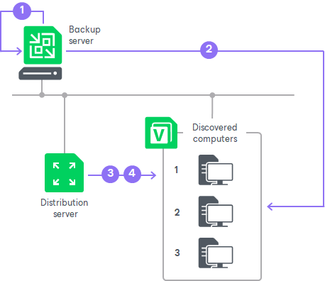

# Rescan Job

In this article

For automated discovery of protected computers, Veeam Backup & Replication uses the rescan job that runs on the backup server. Veeam Backup & Replication automatically creates this job once you create the first protection group in the inventory. The rescan job runs upon schedule defined individually for every protection group in the protection group settings. By default, Veeam Backup & Replication is set up to perform discovery at 9:00 PM daily. You can adjust daily schedule in the protection group settings or define periodic schedule.

The rescan job itself is not displayed in the Veeam Backup & Replication console. However, you can start rescan job sessions manually for a specific protection group or individual computer in the inventory. This may be helpful, for example, if new computers appeared in your infrastructure, and you want to discover these computers without waiting for the next scheduled rescan job session start. To learn more, see [Rescanning Protection Group](agents_protection_group_rescan.md) and [Rescanning Protected Computer](agents_protected_computers_rescan.md).

You can view statistics for currently running and already performed rescan job sessions. To learn more, see [Viewing Rescan Job Statistics](agents_reporting_stats.md).

Considerations and Limitations

Consider the following about rescan of protection group and computer discovery:

* Automatic installation of nonsnap Veeam Agent for Linux during rescan is not available. If you want to add a computer with nonsnap Veeam Agent for Linux to a protection group, you must deploy Veeam Agent on the protected computer first. For more information on standalone installation of nonsnap Veeam Agent for Linux, see the [Installation and Configuration](https://helpcenter.veeam.com/docs/agentforlinux/userguide/installation.html?ver=13) section of the Veeam Agent for Linux User Guide.
* Automatic upgrade of nosnap Veeam Agent for Linux during rescan is not available. You must upgrade such Veeam Agents on the protected computer side, manually or using third-party tools.
* Rescan is available for all protection groups except protection groups for pre-installed Veeam Agents and their individual members. Veeam Agents installed on computers included in protection groups for pre-installed Veeam Agents synchronize with Veeam Backup & Replication every 6 hours and provide information about the Veeam Agent computer. If necessary, you can synchronize Veeam Agent with Veeam Backup & Replication running a command from the Veeam Agent computer. To learn more, see [Backup Policy Application Methods](agents_policy_apply.md).

How It Works

When the rescan job is started — either automatically upon schedule or manually — Veeam Backup & Replication performs the following operations:

1. Obtains settings specified for the protection group from the configuration database. The settings include a list of computers to scan, a method for connecting to these computers, and so on.
2. Connects to each computer in the list using a connection method specified in the protection group settings.
3. Deploys Veeam components on each newly discovered computer:

* On Windows-based computers, Veeam Backup & Replication deploys Veeam Installer Service and Veeam OpenSSL3 FIPS Provider. After that, Veeam Installer Service deploys Veeam Transport Service.
* On Linux-based computers, Veeam Backup & Replication deploys Veeam Deployer Service and Veeam OpenSSL3 FIPS Provider. After that, Veeam Deployer Service deploys Veeam Transport Service.
* On Unix-based computers, Veeam Backup & Replication deploys Veeam Installer Service and Veeam OpenSSL3 FIPS Provider.
* On Amazon EC2 instances or Microsoft Azure virtual machines (both objects can be also referred to as cloud machines), Veeam Backup & Replication deploys Veeam Transport Service, Veeam OpenSSL3 FIPS Provider and Veeam Cloud Message Service.

|  |
| --- |
| NOTE |
| Consider the following:   1. You can manually pre-install Veeam components using Veeam Deployment Kit. In this case, Veeam Backup & Replication will make the initial connection to such computers using a single-use certificate. For more information on this deployment option, see [Deploying Veeam Agent Using Veeam Deployment Kit](agents_deploy_deployer.md). 2. On computers where Veeam Transport Service is already installed, Veeam Backup & Replication checks the Veeam Transport Service version. If a later version is available, Veeam Backup & Replication upgrades Veeam Transport Service. |

1. If the automatic Veeam Agent deployment option is enabled in the protection group settings, Veeam components also deploy Veeam Agent on discovered computers. As a part of this process, Veeam Backup & Replication performs the following operations:

1. Veeam components running on the computer collect information about the computer and send it to Veeam Backup & Replication. The collected data includes details on the computer type, platform, hostname, guest OS, IP address, BIOS UUID, and information about Veeam Agent (its presence on the computer, product version and license installed).
2. Veeam Backup & Replication uploads the Veeam Agent setup files:

* On Windows-based, Linux-based computers and Unix-based machines, Veeam Backup & Replication uploads files to the discovered computers using the distribution server.

* On Amazon EC2 instances or Microsoft Azure virtual machines, Veeam Backup & Replication uploads files from the distribution repository to the discovered instances and virtual machines.

|  |
| --- |
| TIP |
| To prevent protected computers from being compromised, Veeam Backup & Replication validates the integrity and authenticity of the Veeam Agent installation package before uploading it to the computer. |

1. Veeam services deploy Veeam Agent:

* On Windows-based computers, Veeam Installer Service installs Veeam Agent on the target computer.
* On Linux-based computers, Veeam Deployer Service installs Veeam Agent on the target computer.
* On Unix-based computers, Veeam Installer Service installs Veeam Agent on the target computer.

* On Amazon EC2 instances or Microsoft Azure virtual machines, Veeam Cloud Message Service installs Veeam Agent on the target cloud machine.

Related Tasks

* [Creating Protection Groups](protection_group_add.md)
* [Rescanning Protection Group](agents_protection_group_rescan.md)
* [Rescanning Protected Computer](agents_protected_computers_rescan.md)
* [Viewing Rescan Job Statistics](agents_reporting_stats.md)

Page updated 11/3/2025

Page content applies to build 13.0.1.1071
