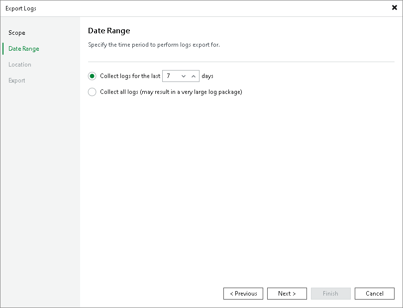

# Step 3. Specify Time Interval

In this article

At the Date Range step of the wizard, define the time interval for which logs must be collected. You can select one of the following options:

* Collect logs for the last <N> days
* Collect all available logs

Page updated 5/23/2025

Page content applies to build 13.0.1.1071
