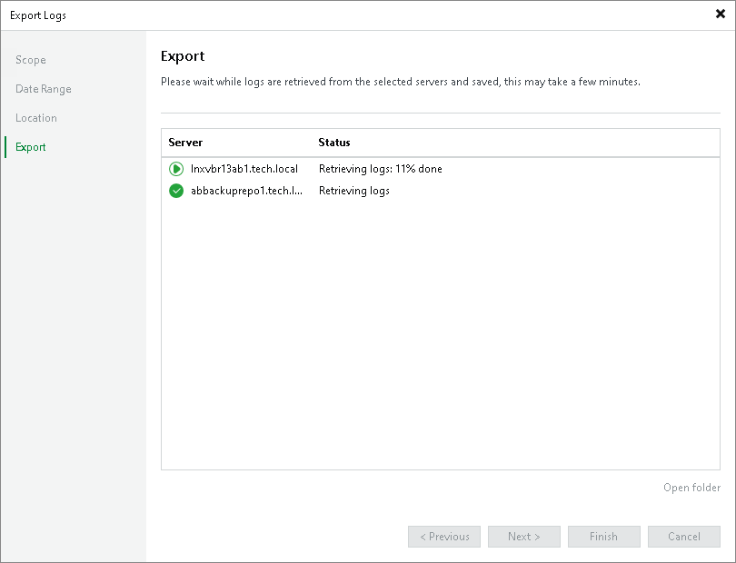

# Step 5. Review Results

At the Export step of the wizard, Veeam Backup & Replication will collect specified logs and create a log archive. Wait for the export process to complete, review the results and click the Open folder link to browse the exported log files.

|  |
| --- |
| Tip |
| During the log export process, Veeam Backup & Replication locks the console, so you cannot close the Export Logs wizard. If you do not want to wait until the log export process completes, you can run another session of the Veeam Backup & Replication concurrently and continue work with it. |

