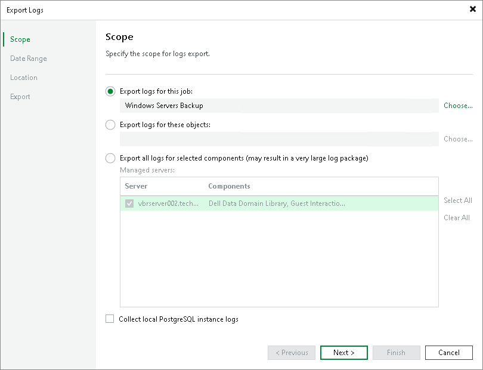

# Step 2. Select Infrastructure Scope

In this article

At the Scope step of the wizard, define the scope for Veeam Agent logs export. You can select one of the following options:

* Export logs for this job — select this option if you want to export logs for specific backup jobs. Click Choose and specify the necessary backup job.

In this case, Veeam Backup & Replication exports only the Veeam Metrics Collector Log (VMC.log) file that collects product usage metrics and infrastructure information for each Veeam Agent installation.

* Export logs for these objects — select this option if you want to export logs for specific Veeam Agent computers. Click Choose and specify the necessary Veeam Agent computer. If you export logs for a computer with pre-installed Veeam Agent, specify credentials for the user account that has access to the protected computer in the Agent Credentials window. Veeam Backup & Replication will not store these credentials in its database.

|  |
| --- |
| NOTE |
| Consider the following:   * Do not select the Export all logs for selected components option if you want to export Veeam Agent logs. With this option selected, Veeam Backup & Replication retrieves logs from backup infrastructure components where Veeam Agent is not installed. * When you export logs from the Veeam Backup & Replication console, the exported logs will be copied to the machine where the console is installed. The log archive will also contain logs from the console machine. |

|  |
| --- |
| Tip |
| To select multiple jobs or objects at once, do one of the following:   * Hold [Ctrl] and click items to add to your selection. * Hold [Shift] and select a range of items between the currently selected item and the one you click. |

Page updated 9/17/2025

Page content applies to build 13.0.1.1071
