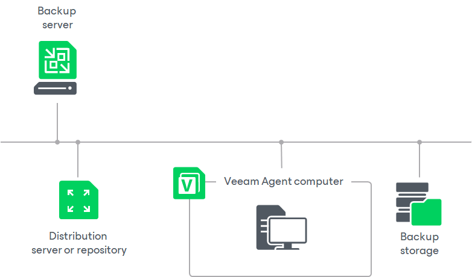

# Veeam Agent Management Infrastructure

In this article

The Veeam Agent management infrastructure comprises the following components:

* [Veeam backup server](#vbr)
* [Veeam Agent computers](#agent)
* [Distribution server](#distribution)
* [Distribution repository](#repo)

Veeam Backup Server

The Veeam backup server is the core component in the backup infrastructure that fills the role of the “configuration and control center”. To use the Veeam Agent management functionality offered by Veeam Backup & Replication, you can use the backup server that is already running in your backup infrastructure or deploy a separate backup server.

To learn more, see [Deployment](deployment.md).

Veeam Agent Computers

To manage Veeam Agents on computers in your infrastructure, you must add computers that you want to protect to the inventory in the Veeam Backup & Replication console and deploy Veeam Agents. In Veeam Backup & Replication, protected computers are organized into protection groups. To learn more, see [Protection Groups](agents_protection_groups.md).

Veeam Backup & Replication lets you manage Veeam Agent on computers of the following types:

* Workstations, servers, failover clusters, and cloud machines running a Microsoft Windows OS
* Workstations, servers, and cloud machines running a Linux OS
* Servers running a Unix OS
* Workstations and servers running a macOS

If you want to manage Veeam Agents installed on protected computers in Veeam Backup & Replication, you must set Veeam Agents in the managed mode. In this mode, all data protection and administration tasks are performed by a user that has the Veeam Backup Administrator role or a custom role in Veeam Backup & Replication. To learn more, see [Managing Users and Roles](users_roles.md).

In some scenarios, a user can also perform a limited set of backup and disaster recovery tasks directly on a protected computer.

The following Veeam Agent configurations operate in the managed mode:

* [Veeam Agents deployed on remote computers and cloud machines by Veeam Backup & Replication automatically](#vbr)
* [Veeam Agents deployed on remote computers by user manually](#user)

Veeam Agents Deployed on Remote Computers and Cloud Machines by Veeam Backup & Replication Automatically

Veeam Backup & Replication can automatically discover computers added to the inventory and deploy Veeam Agents on these computers. Veeam Agent for Mac can be deployed [manually](#user) only. To learn more about automatic deployment of Veeam Agents, see [Protected Computers Discovery and Veeam Agent Deployment](agents_discovery_and_deployment.md).

* On Microsoft Windows computers, Veeam Backup & Replication deploys Veeam Installer Service. Veeam Installer Service, in turn, deploys Veeam Transport Service that performs the necessary operations on the computer.

* On Linux computers, Veeam Backup & Replication connects to the Linux computer using SSH credentials and installs Veeam Deployer Service. After that, Veeam Deployer Service installs Veeam Transport Service that performs necessary operations on the computer.

|  |
| --- |
| NOTE |
| You can manually pre-install Veeam Installer Service on a Microsoft Windows computer and Veeam Deployer Service — on a Linux computer using Veeam Deployment Kit. In this case, Veeam Backup & Replication will make the initial connection to such computers using a single-use certificate. For more information on this deployment option, see [Deploying Veeam Agent Using Veeam Deployment Kit](agents_deploy_deployer.md). |

Keep in mind that Veeam Backup & Replication requires an SSH connection with the Linux computer in the following cases:

* To communicate with the Linux computer for the first time if you use credentials to connect to the Linux computer. To learn more, see [Specifying Computers](agents_protection_group_computers.md).

After Veeam Backup & Replication computer is discovered and Veeam Agent is deployed, Veeam Backup & Replication uses Veeam Deployer and Transport Services to connect to the Veeam Agent computer instead of the SSH connection.

* To communicate with the Linux computer after Veeam Deployer and Transport Services failed to establish a connection. In this case Veeam Backup & Replication fails over to the SSH connection.

To establish the SSH connection, the Linux computer must be added to the list of trusted hosts. To learn more, see [Configuring Security Settings](agents_manage_tls_and_ssh.md).

* On Unix computers, Veeam Backup & Replication connects to the Unix computer using SSH credentials and deploys Veeam Installer Service. After that, Veeam Installer Service installs Veeam Agent packages on the machine. The same rules for failover to SSH on Linux computers apply to Unix computers.
* On Amazon EC2 instances or Microsoft Azure virtual machines (both objects can be also referred to as cloud machines), Veeam Backup & Replication installs Veeam Transport Service and Veeam Cloud Message Service that perform necessary operations on the machine.

Veeam Agents Deployed on Remote Computers by User Manually

You must manually deploy Veeam Agent for Mac on the computer you want to protect and set connection to Veeam Backup & Replication. You can also manually deploy Veeam Agent for Microsoft Windows, Veeam Agent for Linux, Veeam Agent for Oracle Solaris and Veeam Agent for IBM AIX. After you deploy Veeam Agent, you can use Veeam Backup & Replication to perform necessary operations on the computers. To learn more about manual deployment of Veeam Agents, see [Protected Computers Discovery and Veeam Agent Deployment](agents_discovery_and_deployment.md).

Distribution Server

The distribution server is an architecture component in the Veeam Agent management infrastructure used for automated deployment of Veeam Agent setup files to protected computers. The distribution server comprises the Veeam Distribution Service. When you instruct Veeam Backup & Replication to install Veeam Agent on a protected computer, the Veeam backup server communicates uses the distribution server to upload Veeam Agent setup files to the target computer.

By default, the role of the distribution server is assigned to the backup server itself. However, you can deploy a dedicated distribution server to reduce load on the backup server. To deploy a distribution server, you need to add a Windows-based or Linux-based server to Veeam Backup & Replication. To learn more, see [Adding Microsoft Windows Servers](add_windows_server.md) and [Adding Linux Servers](add_linux_server.md). After you assigned the role of distribution server, you need to select this server in the properties of a protection group. To learn more, see [Creating Protection Groups](protection_group_add.md).

A machine performing the role of the distribution server must meet the following requirements:

* The role of the distribution server can be assigned to a physical or virtual machine.
* The machine must run one of the following 64-bit OSes:

* Microsoft Windows Server 2016 or later
* Microsoft Windows 10 LTSB 2021 or later
* RHEL 9.6 or later
* Rocky Linux 9.6 or later

|  |
| --- |
| IMPORTANT |
| If you use RHEL or Rocky Linux, and do not use [Veeam Infrastructure Appliance](linux_infrastructure.md), you must install the following packages before adding the server to the backup infrastructure: aspnetcore-runtime (version 8.0 or later), bindfs, libmsi1, samba-client and ntfs-3g. |

* You must add the machine to the Veeam Backup & Replication console as a managed server.

Keep in mind that Veeam Backup & Replication does not support automated deployment of Veeam Agent for Mac and nosnap Veeam Agent for Linux (including Veeam Agent for Linux on Power). You must deploy Veeam Agent for Mac on protected computers using setup files generated by Veeam Backup & Replication. To learn more, see [Deploying Veeam Agents Using Generated Setup Files](agents_deploy_with_generated_file.md).

|  |
| --- |
| TIP |
| If you have several Microsoft Windows and Linux computers and Unix machines with Veeam Agent installations managed by Veeam Backup & Replication, you can centrally deploy a hotfix on all managed Veeam Agent computers. To learn more, see [Deploying Hotfix on Protected Computers](appendix_a_centralized_hotfix_deployment.md). |

Distribution Repository

The distribution repository is an architecture component in the Veeam Agent management infrastructure used for automated deployment of Veeam Agent setup files to cloud machines. When you instruct Veeam Backup & Replication to deploy Veeam Agent on a cloud machine, the Veeam backup server communicates to the distribution repository, and Veeam Backup & Replication uploads Veeam Agent setup file from the distribution repository to the target cloud machine using signed URLs. To learn how Veeam Backup & Replication communicates with Veeam Agents installed on cloud machines, see [Backup of Cloud Machines](agents_backup_cloud_machines.md).

The role of the distribution repository must be assigned to a dedicated object storage repository. To do this, you need to add a Microsoft Azure blob storage or Amazon S3 storage to your infrastructure depending on the type of cloud machines you plan to protect. To learn more, see [Adding Azure Blob Storage](osr_adding_blob_storage.md) or [Adding Amazon S3 Storage](osr_amazon_adding.md).

Consider the following:

* You can store backups of cloud machines only in the object repository located on the same external cloud storage as the cloud machines you want to back up.
* [For Azure Blob Storage] If you plan to use the Azure Blob Storage repository as a distribution repository, you must add this repository using a general-purpose v2 storage account. Other account types are not supported.
* [For Azure Blob Storage] You cannot add a repository using the Microsoft Entra ID account.
* [For Amazon S3 Storage] If you plan to use the Amazon S3 repository in the China region as a distribution repository, make sure that you have the ICP license. This license is required to create signed URLs for Amazon S3 repositories in the China region. For more information, see [AWS Documentation](https://docs.amazonaws.cn/aws/latest/userguide/s3.html).

Page updated 1/13/2026

Page content applies to build 13.0.1.1071
