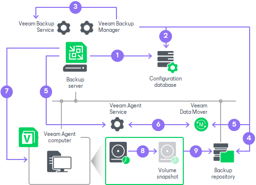

# Backup Job

The backup job that processes Veeam Agent computers runs on the backup server in the similar way as a regular job for VM data backup. You can add one or more protection groups or individual computers to the job and instruct Veeam Backup & Replication to create Veeam Agent backups in a Veeam backup repository or cloud repository. In terms of the Veeam Agent management scenario, the backup job of this type is also referred to as the Veeam Agent backup job managed by the backup server.

For a Veeam Agent backup job managed by the backup server, all job management tasks are performed on the Veeam Backup & Replication side: Veeam Backup & Replication starts the job upon the defined schedule, allocates backup infrastructure resources, and so on. Veeam Agent running on a protected computer operates under control from Veeam Backup & Replication and performs data backup operations only, such as creating a volume snapshot, reading the backed-up data and transferring backed-up data to the target location. To learn more, see [How Veeam Agent Backup Job Works](#job_hiw).

To configure a backup job, you must launch the New Agent Backup Job wizard and select the Managed by backup server option at the Job mode step of the wizard. For backup jobs of this type, Veeam Backup & Replication offers settings similar to settings of a VM backup job, as well as settings specific for Veeam Agents. To learn more, see [Creating Veeam Agent Backup Jobs](agent_job_create.md).

|  |
| --- |
| NOTE |
| * [For Microsoft Windows computers] To manage a Veeam Agent backup job managed by the backup server, you can use the Veeam Backup & Replication console only. On a computer added to a backup job of this type, the Veeam Agent user interface is not available, and you cannot perform operations with Veeam Agent directly on the protected computer. * The Veeam Agent backup job is the only approach to protect members of a protection group for cloud machines. To learn more, see [Protection Group Types](agents_protection_groups_types.md). |

How Veeam Agent Backup Job Works

In the scenario where you use the backup job to create Veeam Agent backups, Veeam Backup & Replication performs backup in the following way:

1. When you create a Veeam Agent backup job in Veeam Backup & Replication, Veeam Backup & Replication saves the backup job settings in its database.
2. When a new backup job session starts, Veeam Backup & Replication starts the Veeam Backup Manager process on the backup server. Veeam Backup Manager reads job settings from the configuration database and creates a list of backup tasks to process. For every protected computer added to the job, Veeam Backup & Replication creates a new task.
3. Veeam Backup Manager connects to the Veeam Backup Service. The Veeam Backup Service includes a resource scheduling component that manages all tasks and resources in the backup infrastructure. The resource scheduler checks what backup infrastructure resources are available, and assigns backup repository to process job tasks.
4. Veeam Backup Manager connects to Veeam Transport Service on the backup repository. The Veeam Transport Service, in its turn, starts Veeam Data Mover. A new instance of Veeam Data Mover is started for every job task.
5. Veeam Backup Manager establishes a connection with Veeam Agent service that runs on the protected computer and Veeam Data Mover that runs on the backup repository, and sets a number of rules for data transfer, such as network traffic throttling rules and so on.
6. Veeam Agent service that runs on the protected computer and Veeam Data Mover that runs on the backup repository establish a connection with each other for data transfer.
7. If application-aware processing is enabled for the job, Veeam Backup & Replication connects to protected computers, establishes a connection with Veeam Agents running on protected computers and performs in-guest processing tasks.
8. Veeam Backup & Replication requests Veeam Agent to trigger a VSS snapshot or volume snapshot, depending on the type of OS running on the Veeam Agent computer. For Windows-based computers, Veeam Agent for Microsoft Windows leverages Microsoft VSS technology to create a VSS snapshot. For Linux-based computers, Veeam Agent for Linux uses the Veeam driver to create a volume snapshot.

For Windows-based computers, if the Microsoft VSS technology fails to create a VSS snapshot for some reason, Veeam Agent for Microsoft Windows resends the request up to 3 times.

1. Veeam Agent service that runs on the protected computer reads the backed-up data from the volume snapshot and transfers the data to the backup repository. During incremental job sessions, the Veeam Agent service uses CBT to retrieve only those data blocks that have changed since the previous job session. If CBT is not available, the Veeam Agent service interacts with the target Veeam Data Mover on the backup repository to obtain backup metadata, and uses this metadata to detect blocks that have changed since the previous job session.

While transporting backed-up data, Veeam Agent running on a protected computer performs additional processing. It filters out zero data blocks, blocks of swap files and blocks of excluded files and folders. Veeam Agent compresses backed-up data and transports it to the target Veeam Data Mover.

Veeam Backup & Replication stores backed-up data to the backup file in the backup repository.

