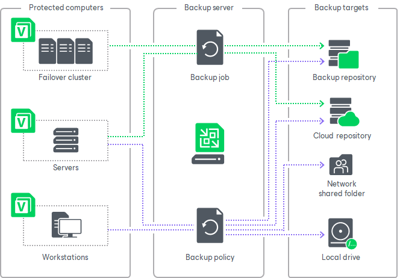

# Veeam Agent Backup Jobs and Policies

In this article

To back up data of your protected computers, you must configure a Veeam Agent backup job. The Veeam Agent backup job defines what data to back up, how, where and when to back up data. In Veeam Backup & Replication, you can create Veeam Agent backup jobs of the following types:

* Backup job

The backup job that processes Veeam Agent computers runs on the backup server in the similar way as a regular job for VM data backup. The backup job is intended for protected computers that have permanent connection to the backup server, such as standalone servers and failover clusters. You can use the backup job to create Veeam Agent backups in a backup repository or cloud repository.

In Veeam Backup & Replication, the backup job of this type is also referred to as the Veeam Agent backup job managed by the backup server.

To learn more, see [Backup Job](agents_job.md).

* Backup policy

The backup policy describes configuration of individual Veeam Agent backup jobs that run on protected computers. Veeam Backup & Replication uses the backup policy as a saved template and applies settings from the backup policy to Veeam Agents that run on computers specified in the backup policy. The backup policy is intended for protected computers that may have limited connection to the backup server, such as workstations, laptops and so on. You can choose to create Veeam Agent backups in a backup repository, cloud repository, network shared folder or on a local storage of a protected computer.

Veeam Agent computers that are members of a protection group for pre-installed Veeam Agents can be processed only by backup policies. To learn more about protection group for pre-installed Veeam Agents, see [Protection Group Types](agents_protection_groups_types.md).

In Veeam Backup & Replication, the backup policy is also referred to as the Veeam Agent backup job managed by Veeam Agent.

To learn more, see [Backup Policy](agents_policy.md).

Veeam Backup & Replication lets you create the following types of backup jobs and policies depending on the type of OS that runs on a protected computer:

* Backup jobs and policies that process Microsoft Windows computers. For such Veeam Agent backup jobs, Veeam Backup & Replication offers settings supported in Veeam Agent for Microsoft Windows.
* Backup jobs and policies that process Linux computers. For such Veeam Agent backup jobs, Veeam Backup & Replication offers settings supported in Veeam Agent for Linux.
* Backup policies that process Unix computers. For such Veeam Agent backup policies, Veeam Backup & Replication offers settings supported in Veeam Agent for IBM AIX and Veeam Agent for Oracle Solaris.
* Backup policies that process Mac computers. For such Veeam Agent backup policies, Veeam Backup & Replication offers settings supported in Veeam Agent for Mac.

If a protection group contains Microsoft Windows computers and Linux computers, you can add this protection group to a Veeam Agent backup job intended for any of these types of protected computers. Veeam Backup & Replication will automatically exclude computers of another type from the backup job and processes only those computers that run an OS of the same type.

For example, if you add a protection group that contains Microsoft Windows and Linux computers to a Veeam Agent backup job intended for Linux computers, Veeam Backup & Replication will exclude Microsoft Windows computers from this backup job and process only Linux computers within the job.

Processing One Computer with Multiple Jobs and Policies

The number of backup jobs and policies that can process the same protected computer depends on the computer type. A protected computer can be processed by more than one Veeam Agent backup job according to the following rules:

* You can include a computer of the Server type in more than one backup job managed by the backup server or more than one backup policy.
* You can include a computer of the Workstation type in one backup policy targeted at a local drive, network shared folder or Veeam backup repository plus unlimited number of backup policies targeted at a Veeam Cloud Connect repository.
* You cannot include the same computer in a backup job and backup policy simultaneously.

Related Topics

* [Backup Job](agents_job.md)
* [Backup Policy](agents_policy.md)

Related Tasks

* [Creating Veam Agent Backup Jobs](agent_job_create.md)
* [Creating Veeam Agent Backup Policies](agent_policy.md)

Page updated 11/4/2025

Page content applies to build 13.0.1.1071
