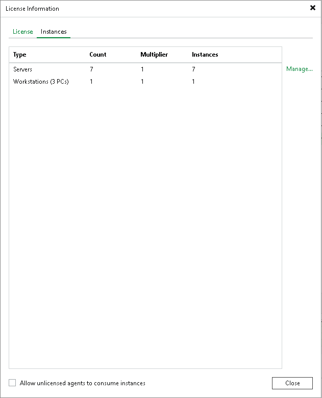

# Licensing Requirements

In this article

The Veeam Agent management functionality is licensed by the number of instances. Instances are units (or tokens) that you can use to protect your computers (servers and workstations) with Veeam Agents.

To back up Veeam Agent computers, you must use a per-instance license in Veeam Backup & Replication. The number of servers and workstations that you can process with Veeam Agents depends on the edition of Veeam Backup & Replication and the number of instances in the license. For more information, see [Veeam Licensing Policy](https://www.veeam.com/licensing-policy.html#instance-conversion).

For more information on Veeam Backup & Replication licensing, see [Licensing](licensing.md).

Managing Instance Consumption by Veeam Agents

After Veeam Agent connects to the Veeam backup server, Veeam Agent starts using instances in the license. You can restrict license consumption for Veeam Agents, for example, if you want to use Veeam Backup & Replication to process VMs and do not want Veeam Agents to use instances in the license.

To restrict instance consumption by all managed Veeam Agents:

1. From the main menu, select License.
2. In the License Information window, click the Instances tab.
3. On the Instances tab, clear the Allow unlicensed agents to consume instances check box.
4. Click Close.

If you do not want to restrict license consumption for all managed Veeam Agents, you can revoke a license from specific Veeam Agents.

To restrict instance consumption by specific Veeam Agents:

1. From the main menu, select License.
2. In the License Information window, click the Instances tab and click Manage.
3. In the Licensed Instances window, select a Veeam Agent and click Remove.

|  |
| --- |
| NOTE |
| Keep in mind that Veeam Agent will start consuming the license again during the next backup job session. |

|  |
| --- |
| TIP |
| With the Assign button, you can assign a license to Veeam Agents operating in the standalone mode. For example, see the [Assigning License to Veeam Agent](https://helpcenter.veeam.com/docs/agentforwindows/userguide/license_vbr_mode.html?ver=13) section in the Veeam Agent for Microsoft Windows User Guide.  You cannot assign a license with the Assign button to Veeam Agents operating in the managed mode. The license type of Veeam Agents operating in the managed mode depends on the job mode specified in the backup job settings. To learn more, see [Working with Veeam Agent Backup Jobs and Policies](backup_job_tasks.md). |

Page updated 11/3/2025

Page content applies to build 13.0.1.1071
