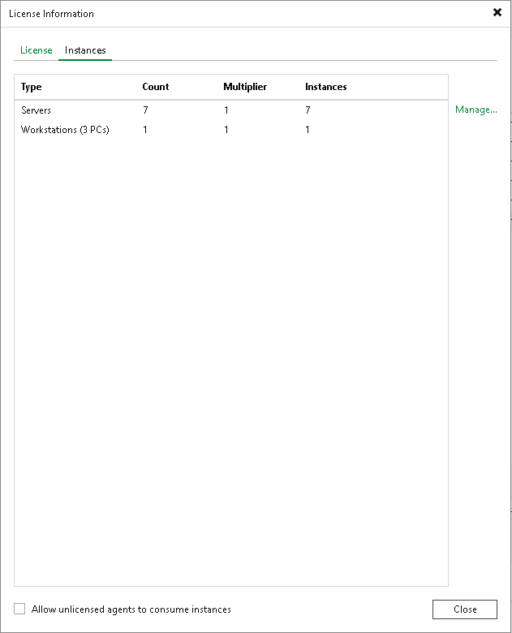
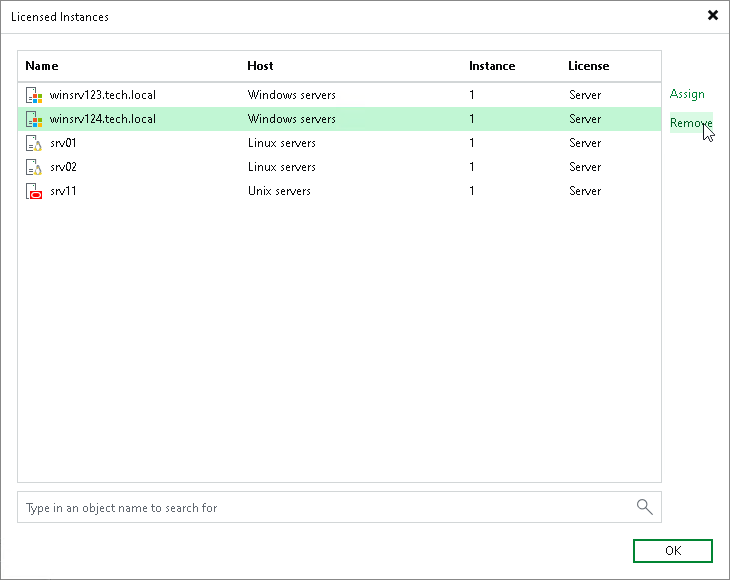

# Licensing Requirements

The Veeam Agent management functionality is licensed by the number of instances. Instances are units (or tokens) that you can use to protect your computers (servers and workstations) with . The number of instances that you can use depends on the type of license installed in Veeam Backup & Replication:

* Per-instance license. If you use a per-instance license in Veeam Backup & Replication, the number of servers and workstations that you can process with Veeam Agents depends on the edition of Veeam Backup & Replication and the number of instances in the license. For more information, see [Veeam Licensing Policy](https://www.veeam.com/licensing-policy.html#instance-conversion).

|  |
| --- |
| Important |
| Per-instance licensing is the only option available for Veeam Agents managed by Veeam Backup & Replication on Linux. |

* Per-socket license. If you use a per-socket license in Veeam Backup & Replication, the product allows you to use up to 6 instances to process Veeam Agents. If the number of sockets in your license is less than 6, you can use the number of instances that equals the number of sockets in the license. For example, if the number of sockets in the license is 5, you can use 5 instances. If the number of sockets in the license is 7, you can use 6 instances.

|  |
| --- |
| NOTE |
| Keep in mind that if you want to use Veeam Agent to protect a VM residing on a virtualization host, Veeam Backup & Replication will use sockets to license such a VM. In this scenario, Veeam Agent will not consume instances in the license, but if no sockets are available, Veeam Agent will not be able to perform backup. |

* Community edition. If you do not install a license in Veeam Backup & Replication, you can use the Community edition of the product. The Community edition of Veeam Backup & Replication allows you to use 10 instances. Functionality available in the Community edition of Veeam Backup & Replication is the same as in the Standard edition of the product.

Keep in mind that in the Community edition of the product, you cannot use to protect computers running on Unix or Linux on Power. To protect such computers, you must use the Enterprise Plus edition of the product.

For more information on Veeam Backup & Replication licensing, see [Licensing](licensing.md).

Managing Instance Consumption by Veeam Agents

Veeam Agents start consuming instances in the license at different moments depending on the agent operation mode:

* Veeam Agents added to [backup jobs managed by the backup server](agents_job.md) start consuming instances when the backup job starts.
* Veeam Agents added to [backup policies](agents_policy.md) start consuming instances when the policy is applied to the Veeam Agent computer.

You can restrict license consumption for Veeam Agents, for example, if you want to use Veeam Backup & Replication to process VMs and do not want to use instances in the license.

To restrict instance consumption by all managed Veeam Agents:

1. From the main menu, select License.
2. In the License Information window, click the Instances tab.
3. On the Instances tab, clear the Allow unlicensed agents to consume instances check box.
4. Click Close.

If you do not want to restrict license consumption for all managed Veeam Agents, you can revoke a license from specific Veeam Agents.

To restrict instance consumption by specific Veeam Agents:

1. From the main menu, select License.
2. In the License Information window, click the Instances tab and click Manage.
3. In the Licensed Instances window, select a Veeam Agent and click Remove.

|  |
| --- |
| NOTE |
| Keep in mind that Veeam Agent will start consuming the license again during the next backup job session. |

|  |
| --- |
| TIP |
| With the Assign button, you can assign a license to Veeam Agents operating in the standalone mode. For example, see the [Assigning License to Veeam Agent](https://helpcenter.veeam.com/docs/agentforwindows/userguide/license_vbr_mode.html?ver=13) section in the Veeam Agent for Microsoft Windows User Guide.  You cannot assign a license with the Assign button to operating in the managed mode. The license type of operating in the managed mode depends on the job mode specified in the backup job settings. To learn more, see [Working with Veeam Agent Backup Jobs and Policies](backup_job_tasks.md). |

|  |
| --- |
| Important |
| Enter your important text here... |

