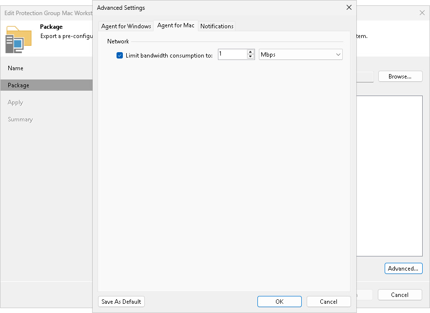

# Veeam Agent for Mac Settings

You can limit bandwidth consumption and restrict network connection usage for Veeam Agent for Mac backup jobs. Limiting bandwidth consumption prevents backup jobs from using all available bandwidth and helps ensure that enough traffic is provided for other network operations.

To limit bandwidth consumption for Veeam Agent for Mac backup jobs, do the following:

1. At the Package step of the wizard, click Advanced.
2. On the Agent for Mac tab, select the Limit bandwidth consumption to check box.
3. Specify the maximum speed for transferring backed-up data from the Veeam Agent computer to the target repository.

Page updated 2026-06-25

