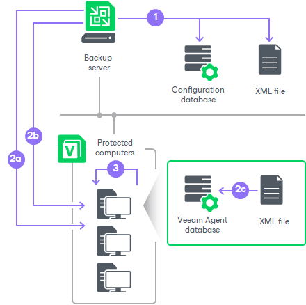
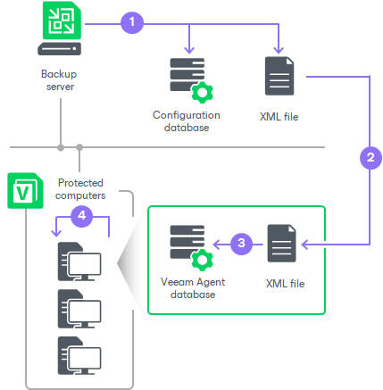

# Backup Policy

In this article

In some cases, the backup job managed by the backup server may be not suitable for data backup with Veeam Agents. For example, you may want use Veeam Agents to back up data of computers that reside in a remote location and have limited connection to the Veeam backup server and backup repository. For such scenarios, Veeam Backup & Replication offers the concept of the backup policy.

The backup policy describes configuration of individual Veeam Agent backup jobs that run on protected computers. You can add one or more protection groups or individual computers to the backup policy and instruct Veeam Agent to create backups in a Veeam backup repository, in a Veeam Cloud Connect repository, network shared folder or local storage of the protected computer. In terms of the Veeam Agent management scenario, the backup policy is also referred to as the Veeam Agent backup job managed by the Veeam Agent.

Veeam Backup & Replication uses the backup policy as a saved template and applies settings from the backup policy to protected computers. The resulting Veeam Agent backup jobs run on protected computers in the similar way as a regular backup job configured directly in Veeam Agent. All backup job management and data processing tasks are performed by Veeam Agent itself. This allows Veeam Agent to create backups of your data even if a connection to the backup server is unavailable. To learn more, see [How Backup Policy Works](#policy_hiw).

To configure a backup policy, you must launch the New Agent Backup Job wizard and select the Managed by agent option at the Job mode step of the wizard. To learn more, see [Creating Veeam Agent Backup Policies](agent_policy.md).

|  |
| --- |
| NOTE |
| * For computers specified in the backup policy, in addition to managing backup settings and performing backup tasks from the Veeam backup console, you can also perform selected operations, including file-level and volume-level restore, directly on a protected computer. In particular, you can use the Veeam Agent control panel to start the backup job manually. This allows you to create ad-hoc backups of your data in addition to backups created upon schedule defined in the backup policy.  * The backup policy is the only approach to protect Unix computers as Veeam Agent for IBM AIX and Veeam Agent for Oracle Solaris do not support backup jobs managed by backup server. * The backup policy is the only approach to protect members of a protection group for pre-installed Veeam Agents. To learn more, see [Protection Group Types](agents_protection_groups_types.md). * For object storage repositories accessed directly, information about the latest backup policy run appears in Veeam Backup & Replication only after synchronization with Veeam Agent. |

How Backup Policy Works

|  |
| --- |
| IMPORTANT |
| Consider that the way how backup policy works for computers included in protection groups for pre-installed Veeam Agents differs from the standard scenario. To learn more, see [How Backup Policy Works With Computer Included In Protection Group for Pre-Installed Veeam Agents](#flex_hiw). |

In the scenario where you use the backup policy to create Veeam Agent backups, Veeam Backup & Replication and Veeam Agents interact in the following way:

1. When you create a backup policy, Veeam Backup & Replication saves the backup policy settings in the following locations on the backup server:

* In the Veeam Backup & Replication database.
* In the configuration file of the XML format.

1. Once the backup policy is created, Veeam Backup & Replication immediately applies the backup policy to Veeam Agents that run on protected computers.

1. Veeam Backup & Replication reads the list of computers and protection groups specified in the backup policy and starts the discovery process for these computers.
2. During the discovery process, Veeam Backup & Replication connects to each computer in the backup policy and uploads the XML file with backup policy settings to the target computer.

1. Veeam Backup & Replication uses settings from the backup policy to configure the Veeam Agent backup job. This process differs depending on the OS of the protected computer:

* On Microsoft Windows computers, Veeam Backup & Replication creates the backup job using the Veeam Agent for Microsoft Windows Configurator.

* On Linux and Unix computers, Veeam Backup & Replication creates the backup job using the Veeam Agent command line interface.

Settings of the created backup job are saved to the Veeam Agent database on the protected computer.

Veeam Backup & Replication regularly applies the backup policy to protected computers during rescan of protection groups added to the backup policy. To learn more, see [Backup Policy Application Methods](agents_policy_apply.md).

1. The created Veeam Agent backup job runs on the protected computer in the similar way as a regular Veeam Agent backup job configured directly on the Veeam Agent computer.

To learn more, see the following sections:

* [How Backup Works](https://helpcenter.veeam.com/docs/agentforwindows/userguide/backup_hiw.html?ver=13) section in the Veeam Agent for Microsoft Windows User Guide.
* [How Backup Works](https://helpcenter.veeam.com/docs/agentforlinux/userguide/backup_hiw.html?ver=13) section in the Veeam Agent for Linux User Guide.
* [How Backup Works](https://helpcenter.veeam.com/docs/agentforaix/userguide/backup_hiw.html?ver=13) section in the Veeam Agent for IBM AIX User Guide.
* [How Backup Works](https://helpcenter.veeam.com/docs/agentforsolaris/userguide/backup_hiw.html?ver=13) section in the Veeam Agent for Oracle Solaris User Guide.

Every 6 hours, Veeam Agent checks whether job settings obtained from the backup policy are up-to-date and do not differ from the current backup settings specified in the backup policy. If the settings differ, Veeam Agent updates backup job settings in its database. To learn more, see [Backup Policy Application Methods](agents_policy_apply.md).

How Backup Policy Works with Computer Included in Protection Group for Pre-Installed Veeam Agents

In the scenario where you use the backup policy to create Veeam Agent backups on Veeam Agent computer included in a protection group for pre-installed Veeam Agents, Veeam Backup & Replication and Veeam Agents interact in the following way:

1. When you create a backup policy, Veeam Backup & Replication saves the backup policy settings in the following locations on the backup server:

* In the Veeam Backup & Replication database.
* In the configuration file of the XML format.

1. Veeam Agent connects to Veeam Backup & Replication and gets the configuration file.

|  |
| --- |
| IMPORTANT |
| Veeam Agent does not connect to Veeam Backup & Replication immediately after updated backup policy settings are saved. Veeam Agent checks whether Veeam Backup & Replication has any updates in the backup policy settings periodically. As a result, a time period between scenario steps 1 and 2 may take up to 6 hours. If necessary, you can synchronize Veeam Agent with Veeam Backup & Replication running a command from the Veeam Agent computer. To learn more, see [Backup Policy Application Methods](agents_policy_apply.md). |

1. Veeam Agent uses the backup policy settings from the configuration file to create a Veeam Agent backup job. Settings of the created backup job are saved to the Veeam Agent database on protected computer.

1. The created Veeam Agent backup job runs on the protected computer in the similar way as a regular Veeam Agent backup job configured directly on the Veeam Agent computer.

To learn more, see the following sections:

* [How Backup Works](https://helpcenter.veeam.com/docs/agentforwindows/userguide/backup_hiw.html?ver=13) section in the Veeam Agent for Microsoft Windows User Guide.
* [How Backup Works](https://helpcenter.veeam.com/docs/agentforlinux/userguide/backup_hiw.html?ver=13) section in the Veeam Agent for Linux User Guide.
* [How Backup Works](https://helpcenter.veeam.com/docs/agentforsolaris/userguide/backup_hiw.html?ver=13) section in the Veeam Agent for Oracle Solaris User Guide.
* [How Backup Works](https://helpcenter.veeam.com/docs/agentforaix/userguide/backup_hiw.html?ver=13) section in the Veeam Agent for IBM AIX User Guide.
* [How Backup Works](https://helpcenter.veeam.com/docs/agentformac/userguide/backup_hiw.html?ver=13) section in the Veeam Agent for Mac User Guide.

Every 6 hours, or when the backup policy starts, Veeam Agent checks whether job settings obtained from the backup policy are up-to-date and do not differ from the current backup settings specified in the backup policy. If the settings differ, Veeam Agent updates backup job settings in its database.

Page updated 11/17/2025

Page content applies to build 13.0.1.1071
